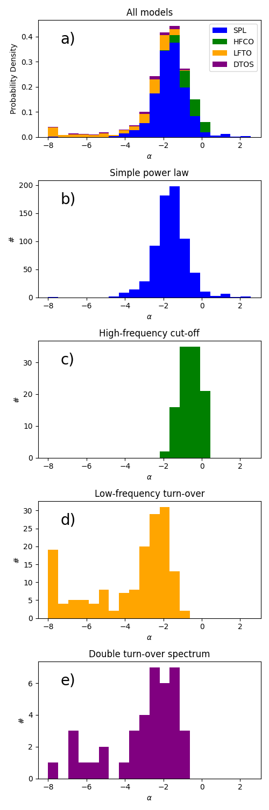
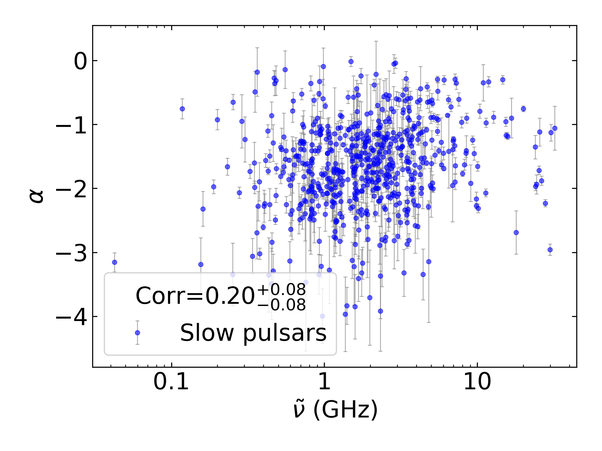
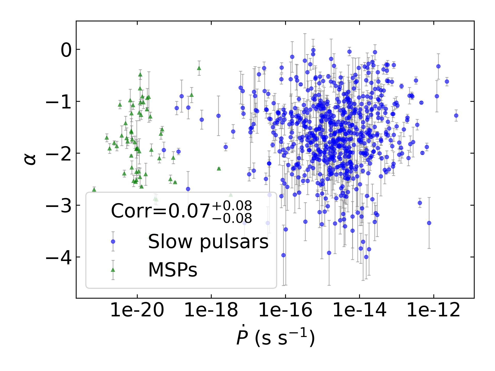
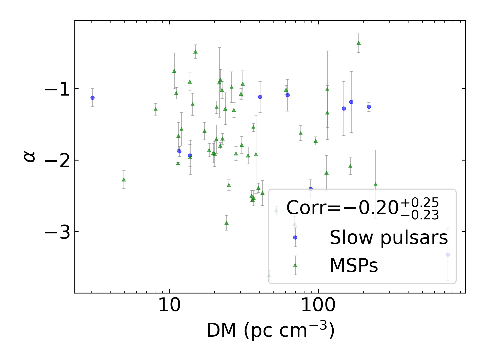
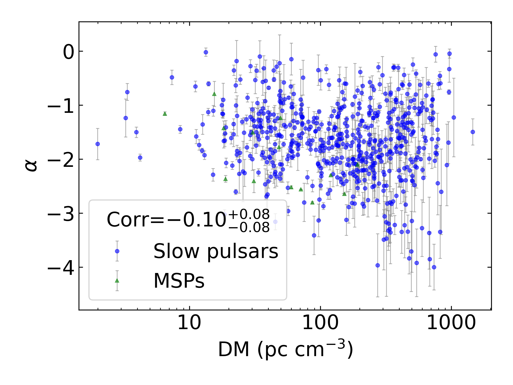
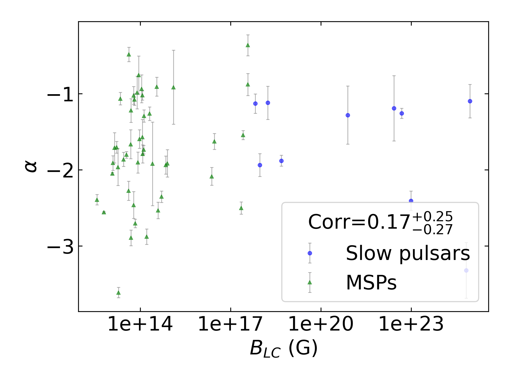
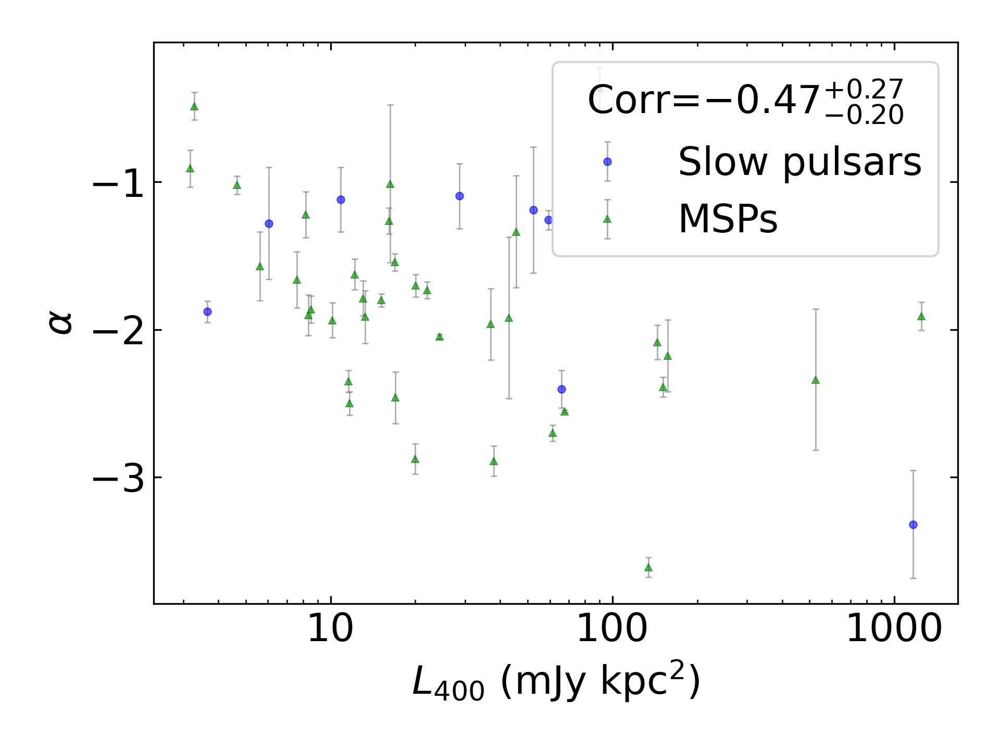

Spectral Index Summary
======================

+------------------------------------------+--------------------------+--------------------------+--------------------------+--------------------------+--------------------------+
|                                      set |                      all |                in binary |                 isolated |                      MSP |                     slow |
+------------------------------------------+--------------------------+--------------------------+--------------------------+--------------------------+--------------------------+
|                                 #pulsars |                      695 |                       64 |                      631 |                       68 |                      627 |
+------------------------------------------+--------------------------+--------------------------+--------------------------+--------------------------+--------------------------+
|                :math:`{\bf log_{10}(x)}` | :math:`{\bf r_s (p, N)}` | :math:`{\bf r_s (p, N)}` | :math:`{\bf r_s (p, N)}` | :math:`{\bf r_s (p, N)}` | :math:`{\bf r_s (p, N)}` |
+==========================================+==========================+==========================+==========================+==========================+==========================+
|                      :math:`\tilde{\nu}` |    0.13 (6.0e-04, 670)   |   -0.14 (2.8e-01,  61)   |    0.17 (3.2e-05, 609)   |   -0.22 (7.8e-02,  65)   |    0.20 (8.5e-07, 605)   |
+------------------------------------------+--------------------------+--------------------------+--------------------------+--------------------------+--------------------------+
| :math:`\left| \dot{\tilde{\nu}} \right|` |    0.10 (8.5e-03, 658)   |   -0.05 (7.2e-01,  59)   |    0.12 (2.3e-03, 599)   |   -0.20 (1.2e-01,  62)   |    0.12 (2.4e-03, 596)   |
+------------------------------------------+--------------------------+--------------------------+--------------------------+--------------------------+--------------------------+
|                          :math:`\dot{P}` |    0.07 (8.4e-02, 652)   |    0.13 (3.5e-01,  55)   |    0.07 (8.6e-02, 597)   |   -0.06 (6.8e-01,  57)   |    0.04 (3.2e-01, 595)   |
+------------------------------------------+--------------------------+--------------------------+--------------------------+--------------------------+--------------------------+
|                               :math:`DM` |   -0.10 (8.2e-03, 670)   |   -0.20 (1.3e-01,  61)   |   -0.10 (9.6e-03, 609)   |   -0.38 (1.7e-03,  65)   |   -0.11 (5.6e-03, 605)   |
+------------------------------------------+--------------------------+--------------------------+--------------------------+--------------------------+--------------------------+
|                           :math:`B_{LC}` |   -0.11 (6.7e-03, 652)   |    0.17 (2.1e-01,  55)   |   -0.14 (7.9e-04, 597)   |    0.22 (1.1e-01,  57)   |   -0.17 (2.8e-05, 595)   |
+------------------------------------------+--------------------------+--------------------------+--------------------------+--------------------------+--------------------------+
|                             :math:`\tau` |   -0.10 (8.2e-03, 652)   |   -0.06 (6.6e-01,  55)   |   -0.11 (5.3e-03, 597)   |    0.19 (1.5e-01,  57)   |   -0.09 (3.0e-02, 595)   |
+------------------------------------------+--------------------------+--------------------------+--------------------------+--------------------------+--------------------------+
|                          :math:`\dot{E}` |    0.13 (1.3e-03, 652)   |   -0.11 (4.2e-01,  55)   |    0.14 (7.4e-04, 597)   |   -0.29 (2.9e-02,  57)   |    0.16 (1.5e-04, 595)   |
+------------------------------------------+--------------------------+--------------------------+--------------------------+--------------------------+--------------------------+
|                          :math:`L_{400}` |   -0.38 (8.3e-23, 607)   |   -0.47 (1.2e-03,  44)   | **-0.41 (1.1e-24, 563)** |   -0.52 (1.4e-04,  48)   | **-0.42 (5.2e-25, 559)** |
+------------------------------------------+--------------------------+--------------------------+--------------------------+--------------------------+--------------------------+
|                         :math:`L_{1400}` |    0.01 (8.5e-01, 640)   |   -0.24 (7.7e-02,  56)   |    0.01 (8.0e-01, 584)   |   -0.31 (1.4e-02,  61)   |    0.02 (6.9e-01, 579)   |
+------------------------------------------+--------------------------+--------------------------+--------------------------+--------------------------+--------------------------+

Spectral Index Mean Summary
---------------------------
.. csv-table::
    :header: "Model", "All Mean", "MSP Mean", "Normal Mean"

    "simple_power_law",                  "-1.62±0.88",   "-1.71±0.89",  "-1.61±0.88"
    "high_frequency_cut_off_power_law",  "-0.63±0.49", "-0.60±0.62", "-0.63±0.47"
    "low_frequency_turn_over_power_law", "-3.72±2.17", "-4.12±2.23", "-3.48±2.12"
    "double_turn_over_spectrum",         "-3.01±1.87", "-3.69±2.17", "-2.84±1.78"
    "Total",                             "-1.89±1.50",           "-0.57±0.65",      "-1.76±1.33"

Spectral Index Median Summary
-----------------------------
.. csv-table::
    :header: "Model", "All Median", "MSP Median", "Normal Median"

    "simple_power_law",                  "-1.62±0.88",   "-1.76±0.89",  "-1.61±0.88"
    "high_frequency_cut_off_power_law",  "-0.59±0.49", "-0.51±0.62", "-0.60±0.47"
    "low_frequency_turn_over_power_law", "-2.77±2.17", "-3.01±2.23", "-2.68±2.12"
    "double_turn_over_spectrum",         "-2.32±1.87", "-2.91±2.17", "-2.30±1.78"
    "Total",                             "-1.67±1.50",           "-0.50±0.65",      "-1.61±1.33"

Spectral Index Histogram
------------------------

:math:`\tilde{\nu}` Correlations
--------------------------------

All Pulsars
^^^^^^^^^^^

.. image:: correlations/corr_line_a_ATNF_Spin_Frequency_(Hz)_log_All_Pulsars.png
    :width: 800

Only Binary Pulsars
^^^^^^^^^^^^^^^^^^^

Only Isolated Pulsars
^^^^^^^^^^^^^^^^^^^^^

.. image:: correlations/corr_line_a_ATNF_Spin_Frequency_(Hz)_log_Only_Isolated_Pulsars.png
    :width: 800

Only MSPs
^^^^^^^^^

.. image:: correlations/corr_line_a_ATNF_Spin_Frequency_(Hz)_log_Only_MSPs.png
    :width: 800

Only Slow Pulsars
^^^^^^^^^^^^^^^^^

:math:`\dot{P}` Correlations
----------------------------

All Pulsars
^^^^^^^^^^^

Only Binary Pulsars
^^^^^^^^^^^^^^^^^^^

.. image:: correlations/corr_line_a_ATNF_Pdot_log_Only_Binary_Pulsars.png
    :width: 800

Only Isolated Pulsars
^^^^^^^^^^^^^^^^^^^^^

.. image:: correlations/corr_line_a_ATNF_Pdot_log_Only_Isolated_Pulsars.png
    :width: 800

Only MSPs
^^^^^^^^^

.. image:: correlations/corr_line_a_ATNF_Pdot_log_Only_MSPs.png
    :width: 800

Only Slow Pulsars
^^^^^^^^^^^^^^^^^

.. image:: correlations/corr_line_a_ATNF_Pdot_log_Only_Slow_Pulsars.png
    :width: 800

:math:`\left| \dot{\tilde{\nu}} \right|` Correlations
-----------------------------------------------------

All Pulsars
^^^^^^^^^^^

.. image:: correlations/corr_line_a_ATNF_Fdot_log_All_Pulsars.png
    :width: 800

Only Binary Pulsars
^^^^^^^^^^^^^^^^^^^

.. image:: correlations/corr_line_a_ATNF_Fdot_log_Only_Binary_Pulsars.png
    :width: 800

Only Isolated Pulsars
^^^^^^^^^^^^^^^^^^^^^

.. image:: correlations/corr_line_a_ATNF_Fdot_log_Only_Isolated_Pulsars.png
    :width: 800

Only MSPs
^^^^^^^^^

.. image:: correlations/corr_line_a_ATNF_Fdot_log_Only_MSPs.png
    :width: 800

Only Slow Pulsars
^^^^^^^^^^^^^^^^^

.. image:: correlations/corr_line_a_ATNF_Fdot_log_Only_Slow_Pulsars.png
    :width: 800

:math:`DM` Correlations
-----------------------

All Pulsars
^^^^^^^^^^^

.. image:: correlations/corr_line_a_ATNF_DM_log_All_Pulsars.png
    :width: 800

Only Binary Pulsars
^^^^^^^^^^^^^^^^^^^

Only Isolated Pulsars
^^^^^^^^^^^^^^^^^^^^^

Only MSPs
^^^^^^^^^

.. image:: correlations/corr_line_a_ATNF_DM_log_Only_MSPs.png
    :width: 800

Only Slow Pulsars
^^^^^^^^^^^^^^^^^

.. image:: correlations/corr_line_a_ATNF_DM_log_Only_Slow_Pulsars.png
    :width: 800

:math:`B_{LC}` Correlations
---------------------------

All Pulsars
^^^^^^^^^^^

.. image:: correlations/corr_line_a_ATNF_B_LC_(G)_log_All_Pulsars.png
    :width: 800

Only Binary Pulsars
^^^^^^^^^^^^^^^^^^^

Only Isolated Pulsars
^^^^^^^^^^^^^^^^^^^^^

.. image:: correlations/corr_line_a_ATNF_B_LC_(G)_log_Only_Isolated_Pulsars.png
    :width: 800

Only MSPs
^^^^^^^^^

.. image:: correlations/corr_line_a_ATNF_B_LC_(G)_log_Only_MSPs.png
    :width: 800

Only Slow Pulsars
^^^^^^^^^^^^^^^^^

:math:`\dot{E}` Correlations
----------------------------

All Pulsars
^^^^^^^^^^^

.. image:: correlations/corr_line_a_ATNF_E_dot_(ergs_s)_log_All_Pulsars.png
    :width: 800

Only Binary Pulsars
^^^^^^^^^^^^^^^^^^^

.. image:: correlations/corr_line_a_ATNF_E_dot_(ergs_s)_log_Only_Binary_Pulsars.png
    :width: 800

Only Isolated Pulsars
^^^^^^^^^^^^^^^^^^^^^

.. image:: correlations/corr_line_a_ATNF_E_dot_(ergs_s)_log_Only_Isolated_Pulsars.png
    :width: 800

Only MSPs
^^^^^^^^^

.. image:: correlations/corr_line_a_ATNF_E_dot_(ergs_s)_log_Only_MSPs.png
    :width: 800

Only Slow Pulsars
^^^^^^^^^^^^^^^^^

.. image:: correlations/corr_line_a_ATNF_E_dot_(ergs_s)_log_Only_Slow_Pulsars.png
    :width: 800

:math:`L_{400}` Correlations
----------------------------

All Pulsars
^^^^^^^^^^^

.. image:: correlations/corr_line_a_L400_(mJy_kpc^2)_log_All_Pulsars.png
    :width: 800

Only Binary Pulsars
^^^^^^^^^^^^^^^^^^^

Only Isolated Pulsars
^^^^^^^^^^^^^^^^^^^^^

Only MSPs
^^^^^^^^^

.. image:: correlations/corr_line_a_L400_(mJy_kpc^2)_log_Only_MSPs.png
    :width: 800

Only Slow Pulsars
^^^^^^^^^^^^^^^^^

.. image:: correlations/corr_line_a_L400_(mJy_kpc^2)_log_Only_Slow_Pulsars.png
    :width: 800

:math:`L_{1400}` Correlations
-----------------------------

All Pulsars
^^^^^^^^^^^

.. image:: correlations/corr_line_a_L1400_(mJy_kpc^2)_log_All_Pulsars.png
    :width: 800

Only Binary Pulsars
^^^^^^^^^^^^^^^^^^^

.. image:: correlations/corr_line_a_L1400_(mJy_kpc^2)_log_Only_Binary_Pulsars.png
    :width: 800

Only Isolated Pulsars
^^^^^^^^^^^^^^^^^^^^^

.. image:: correlations/corr_line_a_L1400_(mJy_kpc^2)_log_Only_Isolated_Pulsars.png
    :width: 800

Only MSPs
^^^^^^^^^

Only Slow Pulsars
^^^^^^^^^^^^^^^^^

.. image:: correlations/corr_line_a_L1400_(mJy_kpc^2)_log_Only_Slow_Pulsars.png
    :width: 800

:math:`\tau` Correlations
-------------------------

All Pulsars
^^^^^^^^^^^

.. image:: correlations/corr_line_a_Age_(Yr)_log_All_Pulsars.png
    :width: 800

Only Binary Pulsars
^^^^^^^^^^^^^^^^^^^

.. image:: correlations/corr_line_a_Age_(Yr)_log_Only_Binary_Pulsars.png
    :width: 800

Only Isolated Pulsars
^^^^^^^^^^^^^^^^^^^^^

.. image:: correlations/corr_line_a_Age_(Yr)_log_Only_Isolated_Pulsars.png
    :width: 800

Only MSPs
^^^^^^^^^

.. image:: correlations/corr_line_a_Age_(Yr)_log_Only_MSPs.png
    :width: 800

Only Slow Pulsars
^^^^^^^^^^^^^^^^^

.. image:: correlations/corr_line_a_Age_(Yr)_log_Only_Slow_Pulsars.png
    :width: 800
