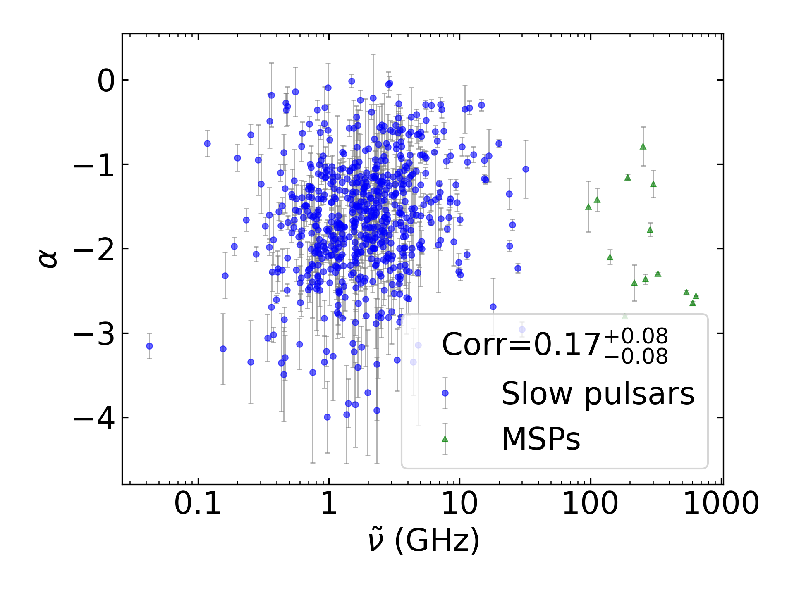
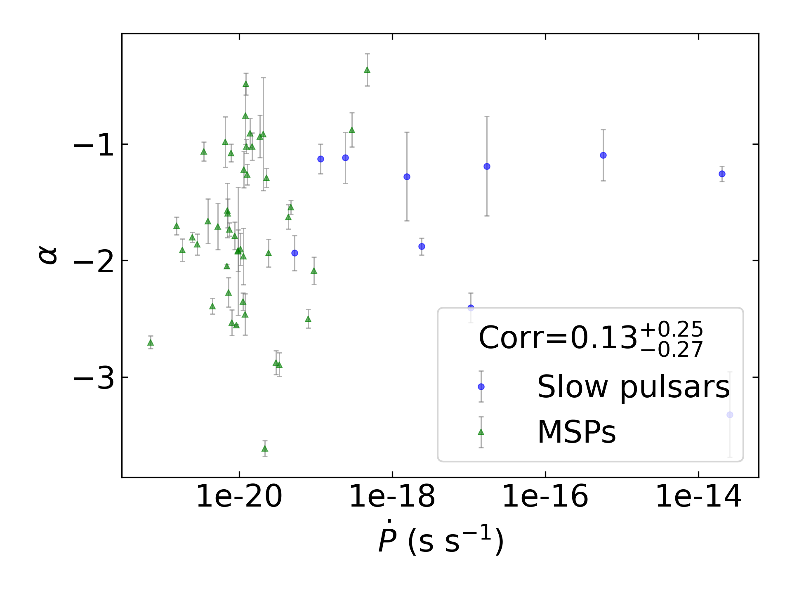
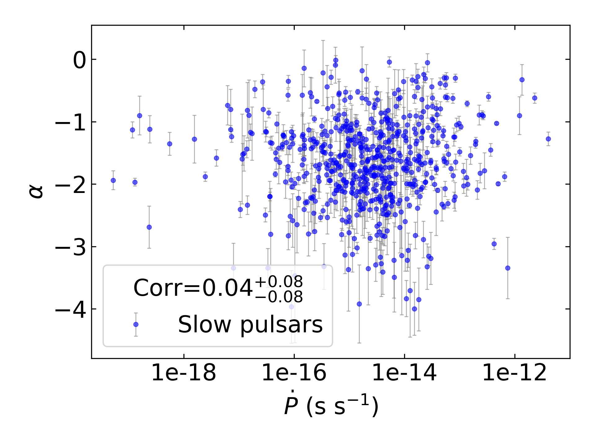
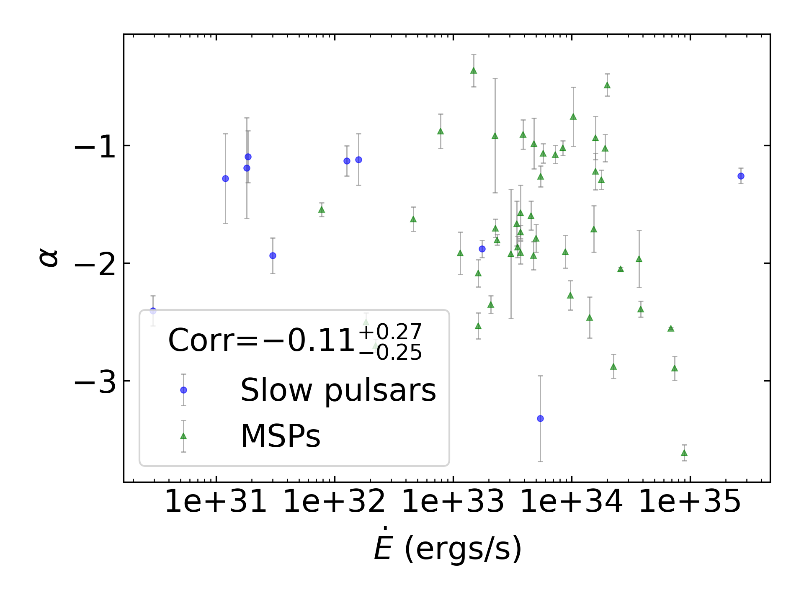
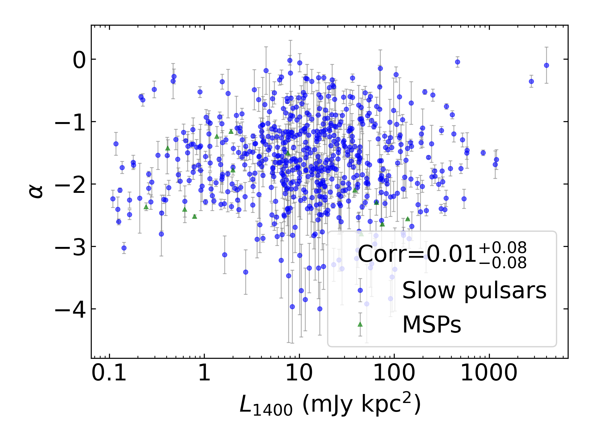
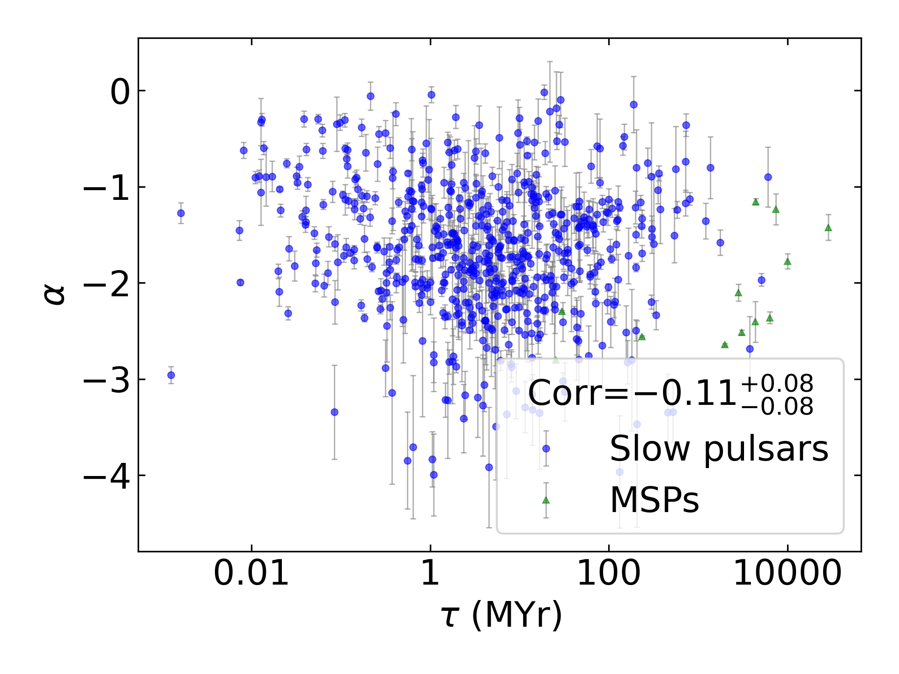
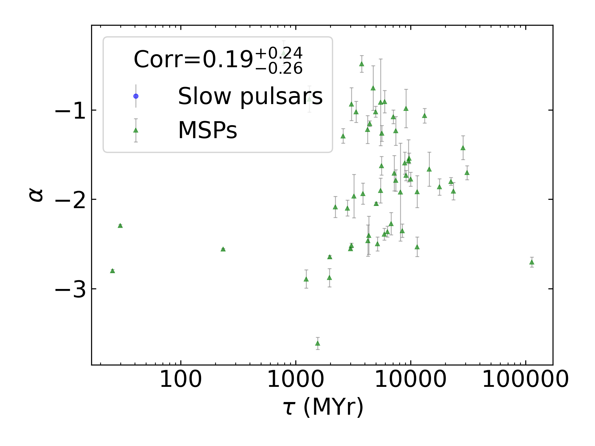
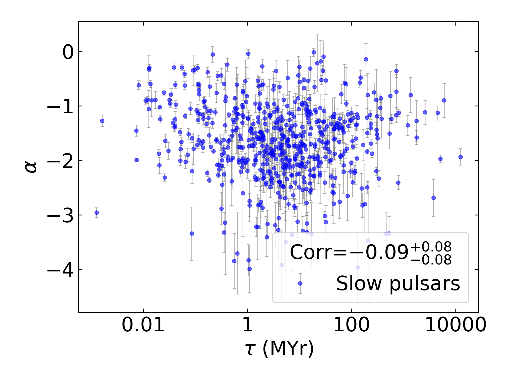

Spectral Index Summary
======================

+------------------------------------------+--------------------------+--------------------------+--------------------------+--------------------------+--------------------------+
|                                      set |                      all |                in binary |                 isolated |                      MSP |                     slow |
+------------------------------------------+--------------------------+--------------------------+--------------------------+--------------------------+--------------------------+
|                                 #pulsars |                      611 |                       52 |                      559 |                       53 |                      558 |
+------------------------------------------+--------------------------+--------------------------+--------------------------+--------------------------+--------------------------+
|                :math:`{\bf log_{10}(x)}` | :math:`{\bf r_s (p, N)}` | :math:`{\bf r_s (p, N)}` | :math:`{\bf r_s (p, N)}` | :math:`{\bf r_s (p, N)}` | :math:`{\bf r_s (p, N)}` |
+==========================================+==========================+==========================+==========================+==========================+==========================+
|                      :math:`\tilde{\nu}` |    0.15 (2.0e-04, 595)   |   -0.16 (2.6e-01,  51)   |    0.19 (6.4e-06, 544)   |   -0.15 (2.9e-01,  52)   |    0.21 (1.4e-06, 543)   |
+------------------------------------------+--------------------------+--------------------------+--------------------------+--------------------------+--------------------------+
| :math:`\left| \dot{\tilde{\nu}} \right|` |    0.13 (1.4e-03, 589)   |   -0.20 (1.7e-01,  51)   |    0.16 (1.4e-04, 538)   |   -0.28 (4.6e-02,  52)   |    0.16 (1.6e-04, 537)   |
+------------------------------------------+--------------------------+--------------------------+--------------------------+--------------------------+--------------------------+
|                          :math:`\dot{P}` |    0.08 (4.8e-02, 588)   |    0.04 (7.9e-01,  51)   |    0.09 (3.6e-02, 537)   |   -0.21 (1.4e-01,  51)   |    0.08 (5.5e-02, 537)   |
+------------------------------------------+--------------------------+--------------------------+--------------------------+--------------------------+--------------------------+
|                               :math:`DM` |   -0.12 (2.8e-03, 595)   |   -0.12 (3.8e-01,  51)   |   -0.13 (1.6e-03, 544)   |   -0.26 (6.4e-02,  52)   |   -0.14 (1.1e-03, 543)   |
+------------------------------------------+--------------------------+--------------------------+--------------------------+--------------------------+--------------------------+
|                           :math:`B_{LC}` |   -0.13 (1.6e-03, 588)   |    0.16 (2.5e-01,  51)   |   -0.16 (1.2e-04, 537)   |    0.12 (4.0e-01,  51)   |   -0.17 (5.2e-05, 537)   |
+------------------------------------------+--------------------------+--------------------------+--------------------------+--------------------------+--------------------------+
|                             :math:`\tau` |   -0.12 (3.3e-03, 588)   |    0.01 (9.5e-01,  51)   |   -0.14 (1.2e-03, 537)   |    0.28 (4.3e-02,  51)   |   -0.13 (2.0e-03, 537)   |
+------------------------------------------+--------------------------+--------------------------+--------------------------+--------------------------+--------------------------+
|                          :math:`\dot{E}` |    0.16 (6.4e-05, 588)   |   -0.17 (2.3e-01,  51)   |    0.19 (1.0e-05, 537)   |   -0.26 (6.7e-02,  51)   |    0.18 (1.9e-05, 537)   |
+------------------------------------------+--------------------------+--------------------------+--------------------------+--------------------------+--------------------------+
|                          :math:`L_{400}` |   -0.39 (3.0e-21, 550)   |   -0.16 (3.3e-01,  41)   | **-0.44 (2.2e-25, 509)** |   -0.27 (8.8e-02,  40)   | **-0.44 (3.5e-25, 510)** |
+------------------------------------------+--------------------------+--------------------------+--------------------------+--------------------------+--------------------------+
|                         :math:`L_{1400}` |    0.02 (6.6e-01, 574)   |    0.15 (3.1e-01,  48)   |   -0.00 (9.8e-01, 526)   |   -0.00 (9.9e-01,  50)   |    0.01 (8.0e-01, 524)   |
+------------------------------------------+--------------------------+--------------------------+--------------------------+--------------------------+--------------------------+

Spectral Index Mean Summary
---------------------------
.. csv-table::
    :header: "Model", "All Mean", "MSP Mean", "Normal Mean"

    "simple_power_law",                  "-1.61±0.87",   "-1.69±0.76",  "-1.61±0.87"
    "high_frequency_cut_off_power_law",  "-0.68±0.52", "-0.91±0.86", "-0.67±0.49"
    "low_frequency_turn_over_power_law", "-3.44±2.23", "-5.34±2.67", "-3.20±2.06"
    "double_turn_over_spectrum",         "-3.84±2.17", "-3.44±2.01", "-4.08±2.34"
    "Total",                             "-1.77±1.37",           "-0.91±0.86",      "-1.71±1.29"

Spectral Index Median Summary
-----------------------------
.. csv-table::
    :header: "Model", "All Median", "MSP Median", "Normal Median"

    "simple_power_law",                  "-1.61±0.87",   "-1.69±0.76",  "-1.60±0.87"
    "high_frequency_cut_off_power_law",  "-0.65±0.52", "-1.07±0.86", "-0.64±0.49"
    "low_frequency_turn_over_power_law", "-2.43±2.23", "-6.17±2.67", "-2.40±2.06"
    "double_turn_over_spectrum",         "-3.07±2.17", "-2.97±2.01", "-3.28±2.34"
    "Total",                             "-1.61±1.37",           "-1.07±0.86",      "-1.58±1.29"

Spectral Index Histogram
------------------------

.. image:: histograms/spectral_index_histogram.png
    :width: 800

:math:`\tilde{\nu}` Correlations
--------------------------------

All Pulsars
^^^^^^^^^^^

.. image:: correlations/corr_line_a_ATNF_Spin_Frequency_(Hz)_log_All_Pulsars.png
    :width: 800

Only Binary Pulsars
^^^^^^^^^^^^^^^^^^^

.. image:: correlations/corr_line_a_ATNF_Spin_Frequency_(Hz)_log_Only_Binary_Pulsars.png
    :width: 800

Only Isolated Pulsars
^^^^^^^^^^^^^^^^^^^^^

Only MSPs
^^^^^^^^^

.. image:: correlations/corr_line_a_ATNF_Spin_Frequency_(Hz)_log_Only_MSPs.png
    :width: 800

Only Slow Pulsars
^^^^^^^^^^^^^^^^^

.. image:: correlations/corr_line_a_ATNF_Spin_Frequency_(Hz)_log_Only_Slow_Pulsars.png
    :width: 800

:math:`\dot{P}` Correlations
----------------------------

All Pulsars
^^^^^^^^^^^

.. image:: correlations/corr_line_a_ATNF_Pdot_log_All_Pulsars.png
    :width: 800

Only Binary Pulsars
^^^^^^^^^^^^^^^^^^^

Only Isolated Pulsars
^^^^^^^^^^^^^^^^^^^^^

.. image:: correlations/corr_line_a_ATNF_Pdot_log_Only_Isolated_Pulsars.png
    :width: 800

Only MSPs
^^^^^^^^^

.. image:: correlations/corr_line_a_ATNF_Pdot_log_Only_MSPs.png
    :width: 800

Only Slow Pulsars
^^^^^^^^^^^^^^^^^

:math:`\left| \dot{\tilde{\nu}} \right|` Correlations
-----------------------------------------------------

All Pulsars
^^^^^^^^^^^

.. image:: correlations/corr_line_a_ATNF_Fdot_log_All_Pulsars.png
    :width: 800

Only Binary Pulsars
^^^^^^^^^^^^^^^^^^^

.. image:: correlations/corr_line_a_ATNF_Fdot_log_Only_Binary_Pulsars.png
    :width: 800

Only Isolated Pulsars
^^^^^^^^^^^^^^^^^^^^^

.. image:: correlations/corr_line_a_ATNF_Fdot_log_Only_Isolated_Pulsars.png
    :width: 800

Only MSPs
^^^^^^^^^

.. image:: correlations/corr_line_a_ATNF_Fdot_log_Only_MSPs.png
    :width: 800

Only Slow Pulsars
^^^^^^^^^^^^^^^^^

:math:`DM` Correlations
-----------------------

All Pulsars
^^^^^^^^^^^

.. image:: correlations/corr_line_a_ATNF_DM_log_All_Pulsars.png
    :width: 800

Only Binary Pulsars
^^^^^^^^^^^^^^^^^^^

.. image:: correlations/corr_line_a_ATNF_DM_log_Only_Binary_Pulsars.png
    :width: 800

Only Isolated Pulsars
^^^^^^^^^^^^^^^^^^^^^

.. image:: correlations/corr_line_a_ATNF_DM_log_Only_Isolated_Pulsars.png
    :width: 800

Only MSPs
^^^^^^^^^

.. image:: correlations/corr_line_a_ATNF_DM_log_Only_MSPs.png
    :width: 800

Only Slow Pulsars
^^^^^^^^^^^^^^^^^

.. image:: correlations/corr_line_a_ATNF_DM_log_Only_Slow_Pulsars.png
    :width: 800

:math:`B_{LC}` Correlations
---------------------------

All Pulsars
^^^^^^^^^^^

.. image:: correlations/corr_line_a_ATNF_B_LC_(G)_log_All_Pulsars.png
    :width: 800

Only Binary Pulsars
^^^^^^^^^^^^^^^^^^^

.. image:: correlations/corr_line_a_ATNF_B_LC_(G)_log_Only_Binary_Pulsars.png
    :width: 800

Only Isolated Pulsars
^^^^^^^^^^^^^^^^^^^^^

.. image:: correlations/corr_line_a_ATNF_B_LC_(G)_log_Only_Isolated_Pulsars.png
    :width: 800

Only MSPs
^^^^^^^^^

.. image:: correlations/corr_line_a_ATNF_B_LC_(G)_log_Only_MSPs.png
    :width: 800

Only Slow Pulsars
^^^^^^^^^^^^^^^^^

.. image:: correlations/corr_line_a_ATNF_B_LC_(G)_log_Only_Slow_Pulsars.png
    :width: 800

:math:`\dot{E}` Correlations
----------------------------

All Pulsars
^^^^^^^^^^^

.. image:: correlations/corr_line_a_ATNF_E_dot_(ergs_s)_log_All_Pulsars.png
    :width: 800

Only Binary Pulsars
^^^^^^^^^^^^^^^^^^^

Only Isolated Pulsars
^^^^^^^^^^^^^^^^^^^^^

.. image:: correlations/corr_line_a_ATNF_E_dot_(ergs_s)_log_Only_Isolated_Pulsars.png
    :width: 800

Only MSPs
^^^^^^^^^

.. image:: correlations/corr_line_a_ATNF_E_dot_(ergs_s)_log_Only_MSPs.png
    :width: 800

Only Slow Pulsars
^^^^^^^^^^^^^^^^^

.. image:: correlations/corr_line_a_ATNF_E_dot_(ergs_s)_log_Only_Slow_Pulsars.png
    :width: 800

:math:`L_{400}` Correlations
----------------------------

All Pulsars
^^^^^^^^^^^

Only Binary Pulsars
^^^^^^^^^^^^^^^^^^^

.. image:: correlations/corr_line_a_L400_(mJy_kpc^2)_log_Only_Binary_Pulsars.png
    :width: 800

Only Isolated Pulsars
^^^^^^^^^^^^^^^^^^^^^

.. image:: correlations/corr_line_a_L400_(mJy_kpc^2)_log_Only_Isolated_Pulsars.png
    :width: 800

Only MSPs
^^^^^^^^^

.. image:: correlations/corr_line_a_L400_(mJy_kpc^2)_log_Only_MSPs.png
    :width: 800

Only Slow Pulsars
^^^^^^^^^^^^^^^^^

.. image:: correlations/corr_line_a_L400_(mJy_kpc^2)_log_Only_Slow_Pulsars.png
    :width: 800

:math:`L_{1400}` Correlations
-----------------------------

All Pulsars
^^^^^^^^^^^

Only Binary Pulsars
^^^^^^^^^^^^^^^^^^^

.. image:: correlations/corr_line_a_L1400_(mJy_kpc^2)_log_Only_Binary_Pulsars.png
    :width: 800

Only Isolated Pulsars
^^^^^^^^^^^^^^^^^^^^^

Only MSPs
^^^^^^^^^

.. image:: correlations/corr_line_a_L1400_(mJy_kpc^2)_log_Only_MSPs.png
    :width: 800

Only Slow Pulsars
^^^^^^^^^^^^^^^^^

.. image:: correlations/corr_line_a_L1400_(mJy_kpc^2)_log_Only_Slow_Pulsars.png
    :width: 800

:math:`\tau` Correlations
-------------------------

All Pulsars
^^^^^^^^^^^

.. image:: correlations/corr_line_a_Age_(Yr)_log_All_Pulsars.png
    :width: 800

Only Binary Pulsars
^^^^^^^^^^^^^^^^^^^

.. image:: correlations/corr_line_a_Age_(Yr)_log_Only_Binary_Pulsars.png
    :width: 800

Only Isolated Pulsars
^^^^^^^^^^^^^^^^^^^^^

Only MSPs
^^^^^^^^^

Only Slow Pulsars
^^^^^^^^^^^^^^^^^

