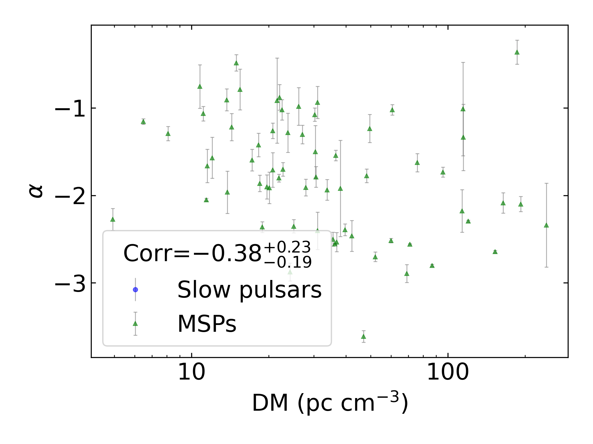
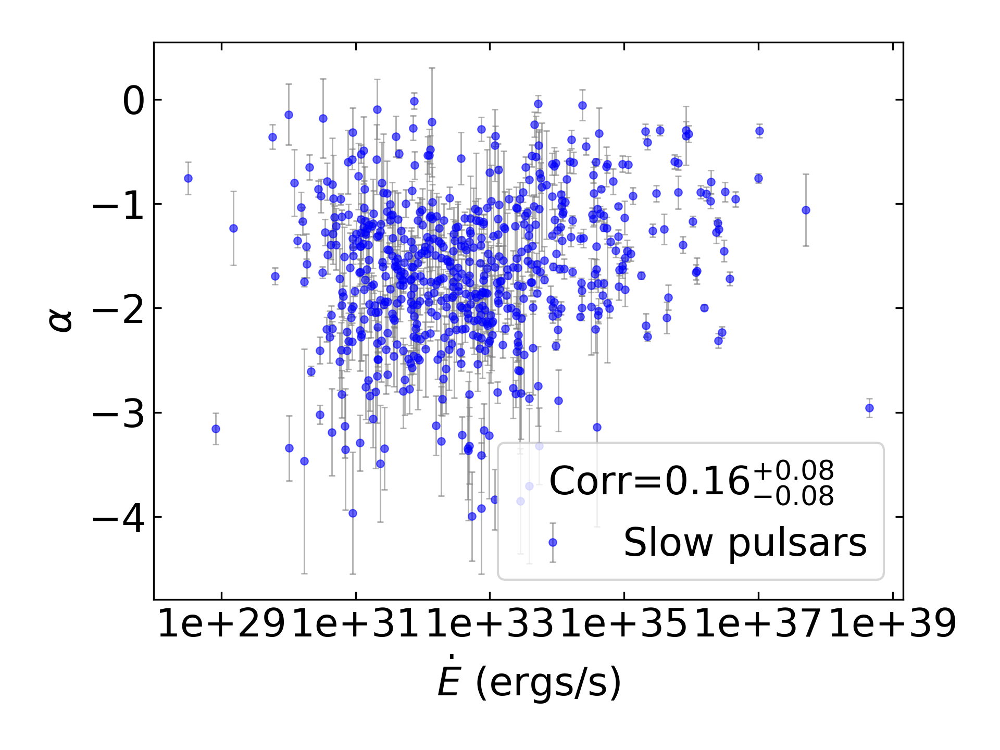
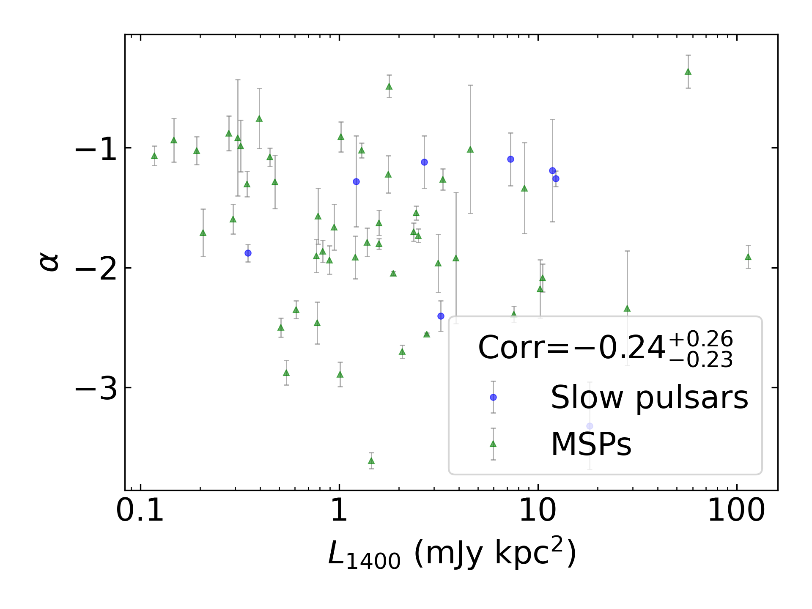
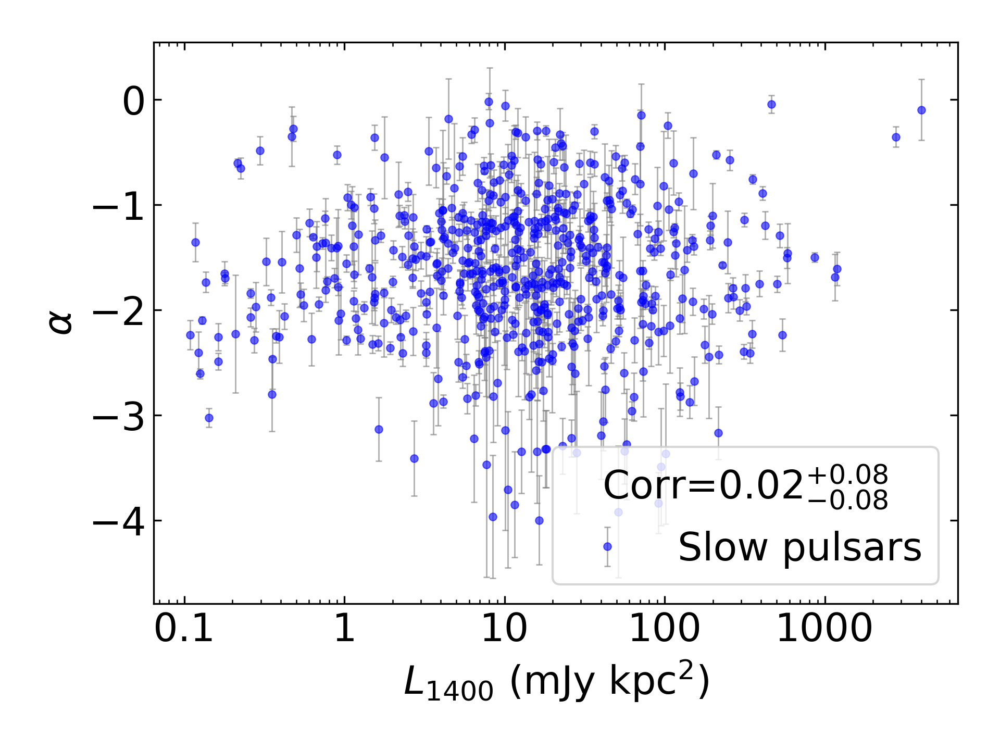
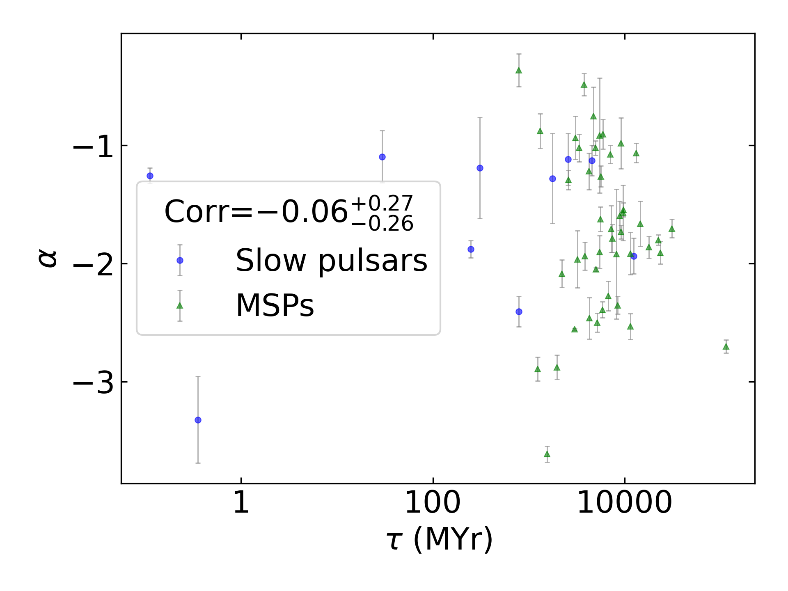

Spectral Index Summary
======================

+------------------------------------------+--------------------------+--------------------------+--------------------------+--------------------------+--------------------------+
|                                      set |                      all |                in binary |                 isolated |                      MSP |                     slow |
+------------------------------------------+--------------------------+--------------------------+--------------------------+--------------------------+--------------------------+
|                                 #pulsars |                      618 |                       53 |                      565 |                       59 |                      559 |
+------------------------------------------+--------------------------+--------------------------+--------------------------+--------------------------+--------------------------+
|                :math:`{\bf log_{10}(x)}` | :math:`{\bf r_s (p, N)}` | :math:`{\bf r_s (p, N)}` | :math:`{\bf r_s (p, N)}` | :math:`{\bf r_s (p, N)}` | :math:`{\bf r_s (p, N)}` |
+==========================================+==========================+==========================+==========================+==========================+==========================+
|                      :math:`\tilde{\nu}` |    0.14 (9.1e-04, 595)   |   -0.12 (3.9e-01,  50)   |    0.17 (1.1e-04, 545)   |   -0.10 (4.7e-01,  57)   |    0.19 (5.5e-06, 538)   |
+------------------------------------------+--------------------------+--------------------------+--------------------------+--------------------------+--------------------------+
| :math:`\left| \dot{\tilde{\nu}} \right|` |    0.11 (5.8e-03, 588)   |   -0.06 (6.8e-01,  50)   |    0.14 (1.1e-03, 538)   |   -0.22 (9.4e-02,  57)   |    0.14 (8.1e-04, 531)   |
+------------------------------------------+--------------------------+--------------------------+--------------------------+--------------------------+--------------------------+
|                          :math:`\dot{P}` |    0.07 (1.1e-01, 585)   |    0.09 (5.4e-01,  49)   |    0.08 (6.3e-02, 536)   |   -0.18 (2.0e-01,  55)   |    0.06 (1.4e-01, 530)   |
+------------------------------------------+--------------------------+--------------------------+--------------------------+--------------------------+--------------------------+
|                               :math:`DM` |   -0.10 (1.4e-02, 595)   |   -0.19 (2.0e-01,  50)   |   -0.10 (1.9e-02, 545)   |   -0.37 (4.1e-03,  57)   |   -0.11 (1.2e-02, 538)   |
+------------------------------------------+--------------------------+--------------------------+--------------------------+--------------------------+--------------------------+
|                           :math:`B_{LC}` |   -0.13 (2.4e-03, 585)   |    0.17 (2.5e-01,  49)   |   -0.15 (5.5e-04, 536)   |    0.11 (4.3e-01,  55)   |   -0.17 (6.3e-05, 530)   |
+------------------------------------------+--------------------------+--------------------------+--------------------------+--------------------------+--------------------------+
|                             :math:`\tau` |   -0.10 (1.5e-02, 585)   |   -0.06 (7.0e-01,  49)   |   -0.12 (4.6e-03, 536)   |    0.25 (6.9e-02,  55)   |   -0.11 (1.0e-02, 530)   |
+------------------------------------------+--------------------------+--------------------------+--------------------------+--------------------------+--------------------------+
|                          :math:`\dot{E}` |    0.15 (2.5e-04, 585)   |   -0.08 (5.6e-01,  49)   |    0.16 (1.9e-04, 536)   |   -0.25 (6.6e-02,  55)   |    0.17 (8.5e-05, 530)   |
+------------------------------------------+--------------------------+--------------------------+--------------------------+--------------------------+--------------------------+
|                          :math:`L_{400}` |   -0.38 (6.2e-20, 543)   |   -0.31 (5.5e-02,  40)   | **-0.42 (8.3e-23, 503)** |   -0.28 (6.4e-02,  44)   | **-0.43 (6.4e-24, 499)** |
+------------------------------------------+--------------------------+--------------------------+--------------------------+--------------------------+--------------------------+
|                         :math:`L_{1400}` |    0.02 (6.5e-01, 571)   |    0.06 (7.1e-01,  47)   |    0.01 (8.1e-01, 524)   |    0.02 (8.8e-01,  54)   |    0.02 (7.2e-01, 517)   |
+------------------------------------------+--------------------------+--------------------------+--------------------------+--------------------------+--------------------------+

Spectral Index Mean Summary
---------------------------
.. csv-table::
    :header: "Model", "All Mean", "MSP Mean", "Normal Mean"

    "simple_power_law",                  "-1.63±0.93",   "-1.68±0.83",  "-1.62±0.94"
    "high_frequency_cut_off_power_law",  "-0.70±0.53", "-0.69±0.56", "-0.71±0.53"
    "low_frequency_turn_over_power_law", "-3.87±2.30", "-5.93±2.32", "-3.66±2.20"
    "double_turn_over_spectrum",         "-3.95±2.66", "-3.22±1.85", "-4.22±2.90"
    "Total",                             "-1.91±1.58",           "-0.71±0.60",      "-1.86±1.53"

Spectral Index Median Summary
-----------------------------
.. csv-table::
    :header: "Model", "All Median", "MSP Median", "Normal Median"

    "simple_power_law",                  "-1.62±0.93",   "-1.66±0.83",  "-1.61±0.94"
    "high_frequency_cut_off_power_law",  "-0.67±0.53", "-0.70±0.56", "-0.67±0.53"
    "low_frequency_turn_over_power_law", "-2.81±2.30", "-6.37±2.32", "-2.78±2.20"
    "double_turn_over_spectrum",         "-3.00±2.66", "-2.68±1.85", "-3.44±2.90"
    "Total",                             "-1.63±1.58",           "-0.85±0.60",      "-1.62±1.53"

Spectral Index Histogram
------------------------

.. image:: histograms/spectral_index_histogram.png
    :width: 800

:math:`\tilde{\nu}` Correlations
--------------------------------

All Pulsars
^^^^^^^^^^^

.. image:: correlations/corr_line_a_ATNF_Spin_Frequency_(Hz)_log_All_Pulsars.png
    :width: 800

Only Binary Pulsars
^^^^^^^^^^^^^^^^^^^

.. image:: correlations/corr_line_a_ATNF_Spin_Frequency_(Hz)_log_Only_Binary_Pulsars.png
    :width: 800

Only Isolated Pulsars
^^^^^^^^^^^^^^^^^^^^^

.. image:: correlations/corr_line_a_ATNF_Spin_Frequency_(Hz)_log_Only_Isolated_Pulsars.png
    :width: 800

Only MSPs
^^^^^^^^^

.. image:: correlations/corr_line_a_ATNF_Spin_Frequency_(Hz)_log_Only_MSPs.png
    :width: 800

Only Slow Pulsars
^^^^^^^^^^^^^^^^^

.. image:: correlations/corr_line_a_ATNF_Spin_Frequency_(Hz)_log_Only_Slow_Pulsars.png
    :width: 800

:math:`\dot{P}` Correlations
----------------------------

All Pulsars
^^^^^^^^^^^

.. image:: correlations/corr_line_a_ATNF_Pdot_log_All_Pulsars.png
    :width: 800

Only Binary Pulsars
^^^^^^^^^^^^^^^^^^^

.. image:: correlations/corr_line_a_ATNF_Pdot_log_Only_Binary_Pulsars.png
    :width: 800

Only Isolated Pulsars
^^^^^^^^^^^^^^^^^^^^^

.. image:: correlations/corr_line_a_ATNF_Pdot_log_Only_Isolated_Pulsars.png
    :width: 800

Only MSPs
^^^^^^^^^

.. image:: correlations/corr_line_a_ATNF_Pdot_log_Only_MSPs.png
    :width: 800

Only Slow Pulsars
^^^^^^^^^^^^^^^^^

.. image:: correlations/corr_line_a_ATNF_Pdot_log_Only_Slow_Pulsars.png
    :width: 800

:math:`\left| \dot{\tilde{\nu}} \right|` Correlations
-----------------------------------------------------

All Pulsars
^^^^^^^^^^^

.. image:: correlations/corr_line_a_ATNF_Fdot_log_All_Pulsars.png
    :width: 800

Only Binary Pulsars
^^^^^^^^^^^^^^^^^^^

.. image:: correlations/corr_line_a_ATNF_Fdot_log_Only_Binary_Pulsars.png
    :width: 800

Only Isolated Pulsars
^^^^^^^^^^^^^^^^^^^^^

.. image:: correlations/corr_line_a_ATNF_Fdot_log_Only_Isolated_Pulsars.png
    :width: 800

Only MSPs
^^^^^^^^^

.. image:: correlations/corr_line_a_ATNF_Fdot_log_Only_MSPs.png
    :width: 800

Only Slow Pulsars
^^^^^^^^^^^^^^^^^

.. image:: correlations/corr_line_a_ATNF_Fdot_log_Only_Slow_Pulsars.png
    :width: 800

:math:`DM` Correlations
-----------------------

All Pulsars
^^^^^^^^^^^

.. image:: correlations/corr_line_a_ATNF_DM_log_All_Pulsars.png
    :width: 800

Only Binary Pulsars
^^^^^^^^^^^^^^^^^^^

.. image:: correlations/corr_line_a_ATNF_DM_log_Only_Binary_Pulsars.png
    :width: 800

Only Isolated Pulsars
^^^^^^^^^^^^^^^^^^^^^

.. image:: correlations/corr_line_a_ATNF_DM_log_Only_Isolated_Pulsars.png
    :width: 800

Only MSPs
^^^^^^^^^

Only Slow Pulsars
^^^^^^^^^^^^^^^^^

.. image:: correlations/corr_line_a_ATNF_DM_log_Only_Slow_Pulsars.png
    :width: 800

:math:`B_{LC}` Correlations
---------------------------

All Pulsars
^^^^^^^^^^^

.. image:: correlations/corr_line_a_ATNF_B_LC_(G)_log_All_Pulsars.png
    :width: 800

Only Binary Pulsars
^^^^^^^^^^^^^^^^^^^

.. image:: correlations/corr_line_a_ATNF_B_LC_(G)_log_Only_Binary_Pulsars.png
    :width: 800

Only Isolated Pulsars
^^^^^^^^^^^^^^^^^^^^^

Only MSPs
^^^^^^^^^

.. image:: correlations/corr_line_a_ATNF_B_LC_(G)_log_Only_MSPs.png
    :width: 800

Only Slow Pulsars
^^^^^^^^^^^^^^^^^

.. image:: correlations/corr_line_a_ATNF_B_LC_(G)_log_Only_Slow_Pulsars.png
    :width: 800

:math:`\dot{E}` Correlations
----------------------------

All Pulsars
^^^^^^^^^^^

.. image:: correlations/corr_line_a_ATNF_E_dot_(ergs_s)_log_All_Pulsars.png
    :width: 800

Only Binary Pulsars
^^^^^^^^^^^^^^^^^^^

.. image:: correlations/corr_line_a_ATNF_E_dot_(ergs_s)_log_Only_Binary_Pulsars.png
    :width: 800

Only Isolated Pulsars
^^^^^^^^^^^^^^^^^^^^^

.. image:: correlations/corr_line_a_ATNF_E_dot_(ergs_s)_log_Only_Isolated_Pulsars.png
    :width: 800

Only MSPs
^^^^^^^^^

.. image:: correlations/corr_line_a_ATNF_E_dot_(ergs_s)_log_Only_MSPs.png
    :width: 800

Only Slow Pulsars
^^^^^^^^^^^^^^^^^

:math:`L_{400}` Correlations
----------------------------

All Pulsars
^^^^^^^^^^^

.. image:: correlations/corr_line_a_L400_(mJy_kpc^2)_log_All_Pulsars.png
    :width: 800

Only Binary Pulsars
^^^^^^^^^^^^^^^^^^^

.. image:: correlations/corr_line_a_L400_(mJy_kpc^2)_log_Only_Binary_Pulsars.png
    :width: 800

Only Isolated Pulsars
^^^^^^^^^^^^^^^^^^^^^

.. image:: correlations/corr_line_a_L400_(mJy_kpc^2)_log_Only_Isolated_Pulsars.png
    :width: 800

Only MSPs
^^^^^^^^^

.. image:: correlations/corr_line_a_L400_(mJy_kpc^2)_log_Only_MSPs.png
    :width: 800

Only Slow Pulsars
^^^^^^^^^^^^^^^^^

.. image:: correlations/corr_line_a_L400_(mJy_kpc^2)_log_Only_Slow_Pulsars.png
    :width: 800

:math:`L_{1400}` Correlations
-----------------------------

All Pulsars
^^^^^^^^^^^

.. image:: correlations/corr_line_a_L1400_(mJy_kpc^2)_log_All_Pulsars.png
    :width: 800

Only Binary Pulsars
^^^^^^^^^^^^^^^^^^^

Only Isolated Pulsars
^^^^^^^^^^^^^^^^^^^^^

.. image:: correlations/corr_line_a_L1400_(mJy_kpc^2)_log_Only_Isolated_Pulsars.png
    :width: 800

Only MSPs
^^^^^^^^^

.. image:: correlations/corr_line_a_L1400_(mJy_kpc^2)_log_Only_MSPs.png
    :width: 800

Only Slow Pulsars
^^^^^^^^^^^^^^^^^

:math:`\tau` Correlations
-------------------------

All Pulsars
^^^^^^^^^^^

.. image:: correlations/corr_line_a_Age_(Yr)_log_All_Pulsars.png
    :width: 800

Only Binary Pulsars
^^^^^^^^^^^^^^^^^^^

Only Isolated Pulsars
^^^^^^^^^^^^^^^^^^^^^

.. image:: correlations/corr_line_a_Age_(Yr)_log_Only_Isolated_Pulsars.png
    :width: 800

Only MSPs
^^^^^^^^^

.. image:: correlations/corr_line_a_Age_(Yr)_log_Only_MSPs.png
    :width: 800

Only Slow Pulsars
^^^^^^^^^^^^^^^^^

.. image:: correlations/corr_line_a_Age_(Yr)_log_Only_Slow_Pulsars.png
    :width: 800
