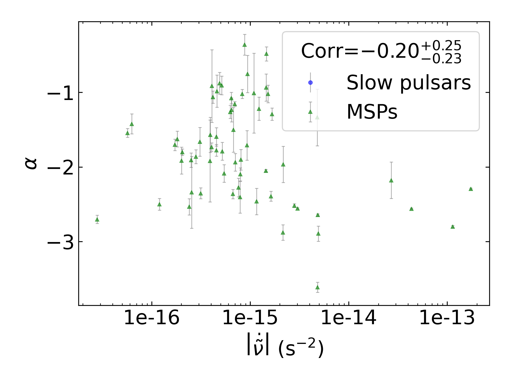
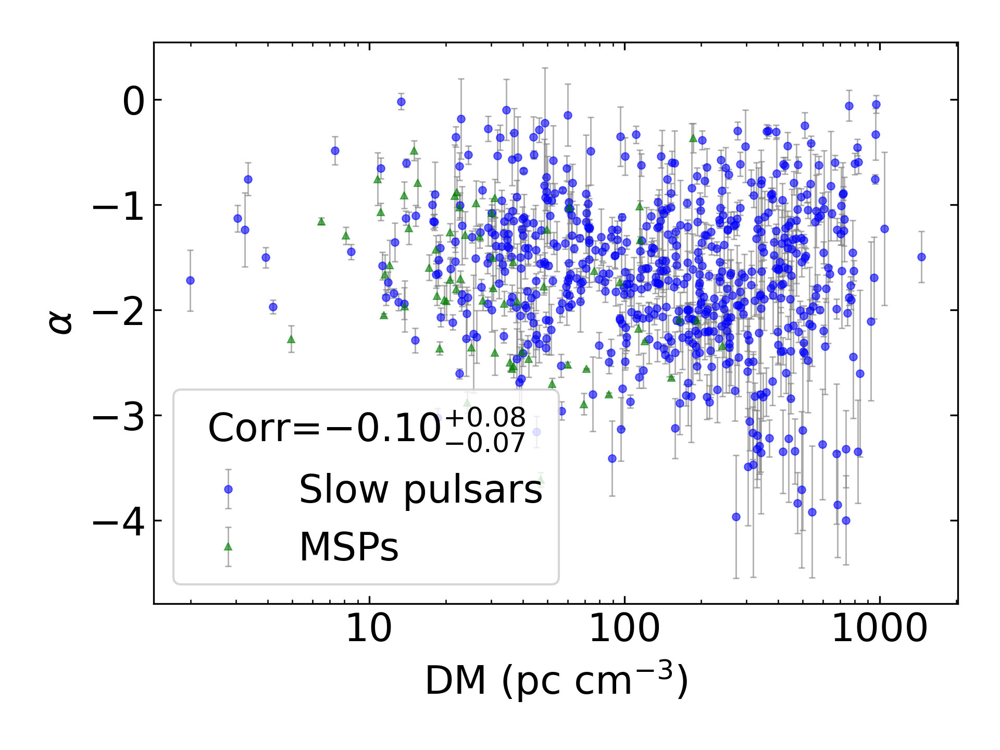
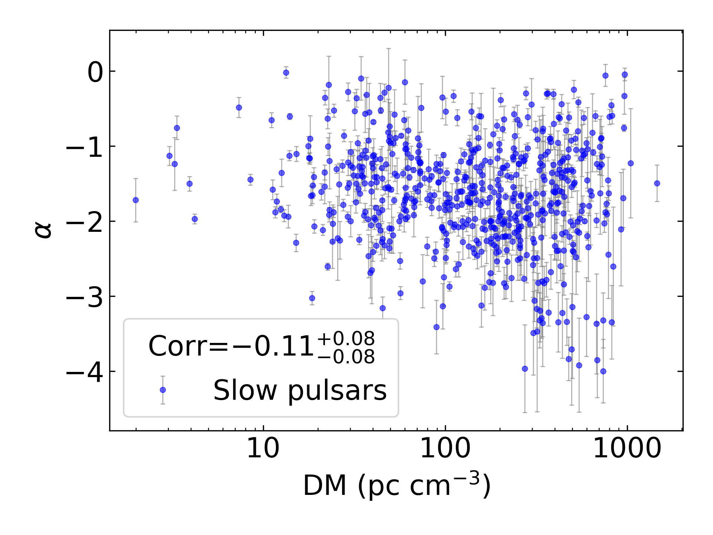
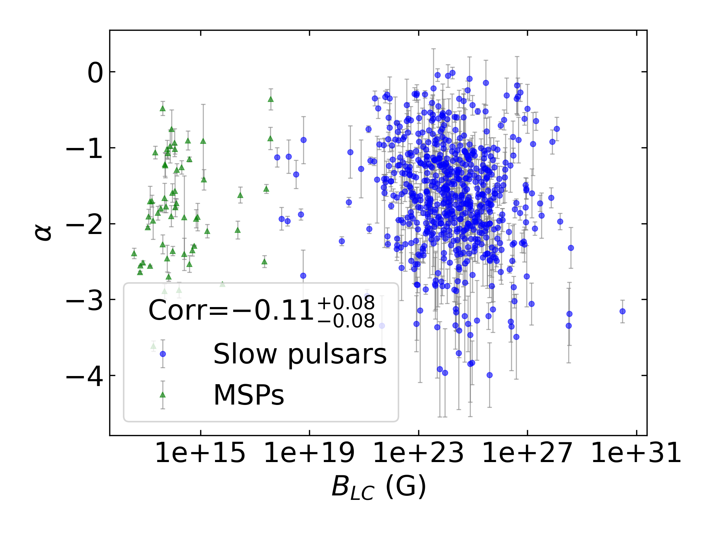
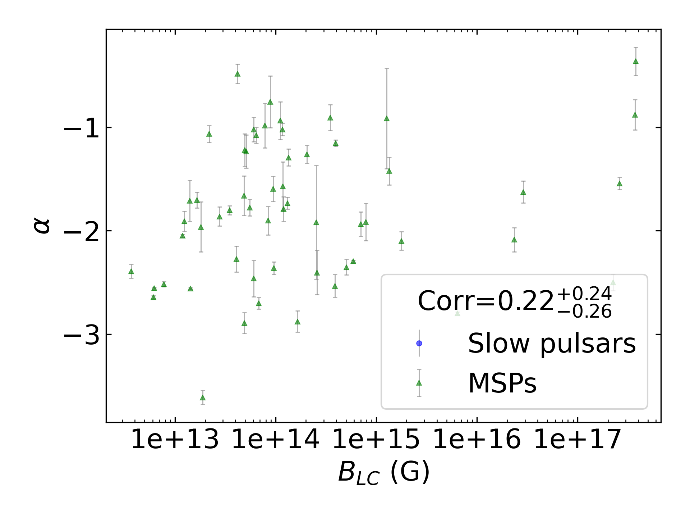
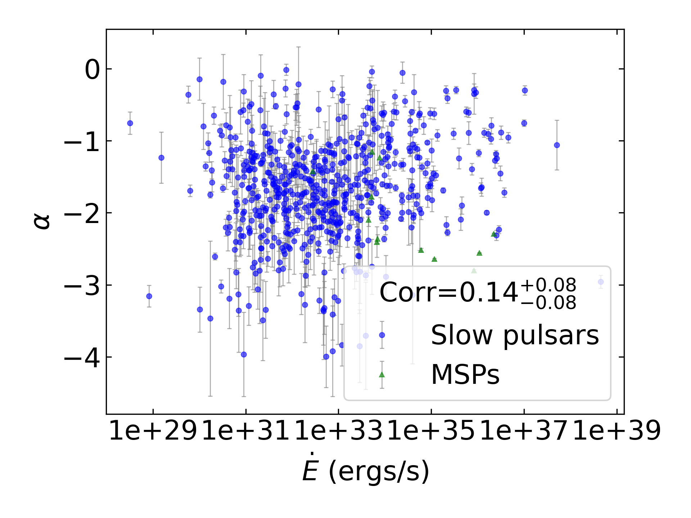
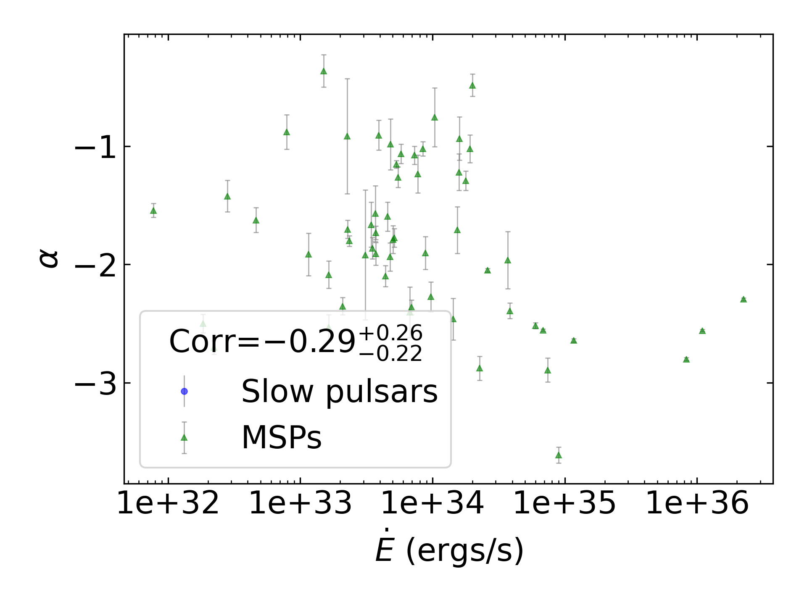
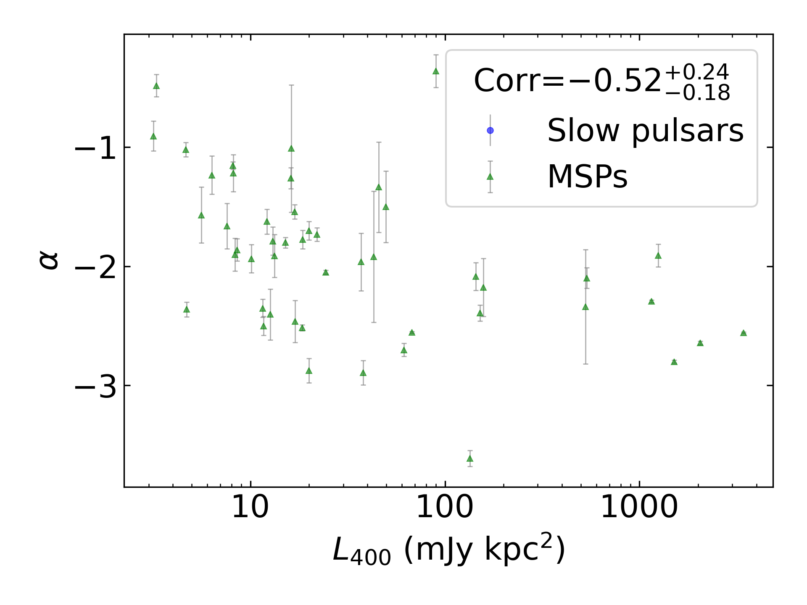
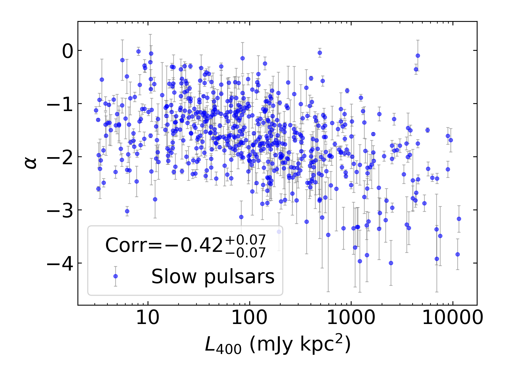
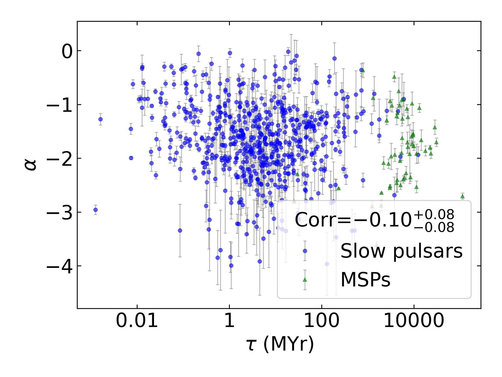

Spectral Index Summary
======================

+------------------------------------------+--------------------------+--------------------------+--------------------------+--------------------------+--------------------------+
|                                      set |                      all |                in binary |                 isolated |                      MSP |                     slow |
+------------------------------------------+--------------------------+--------------------------+--------------------------+--------------------------+--------------------------+
|                                 #pulsars |                      613 |                       53 |                      560 |                       54 |                      559 |
+------------------------------------------+--------------------------+--------------------------+--------------------------+--------------------------+--------------------------+
|                :math:`{\bf log_{10}(x)}` | :math:`{\bf r_s (p, N)}` | :math:`{\bf r_s (p, N)}` | :math:`{\bf r_s (p, N)}` | :math:`{\bf r_s (p, N)}` | :math:`{\bf r_s (p, N)}` |
+==========================================+==========================+==========================+==========================+==========================+==========================+
|                      :math:`\tilde{\nu}` |    0.15 (2.8e-04, 597)   |   -0.18 (2.0e-01,  52)   |    0.19 (6.9e-06, 545)   |   -0.17 (2.2e-01,  53)   |    0.20 (1.6e-06, 544)   |
+------------------------------------------+--------------------------+--------------------------+--------------------------+--------------------------+--------------------------+
| :math:`\left| \dot{\tilde{\nu}} \right|` |    0.13 (1.3e-03, 590)   |   -0.20 (1.5e-01,  52)   |    0.16 (1.4e-04, 538)   |   -0.29 (3.5e-02,  53)   |    0.16 (1.6e-04, 537)   |
+------------------------------------------+--------------------------+--------------------------+--------------------------+--------------------------+--------------------------+
|                          :math:`\dot{P}` |    0.08 (4.4e-02, 589)   |    0.06 (7.0e-01,  52)   |    0.09 (3.8e-02, 537)   |   -0.19 (1.8e-01,  52)   |    0.08 (5.7e-02, 537)   |
+------------------------------------------+--------------------------+--------------------------+--------------------------+--------------------------+--------------------------+
|                               :math:`DM` |   -0.12 (3.3e-03, 597)   |   -0.09 (5.1e-01,  52)   |   -0.14 (1.5e-03, 545)   |   -0.24 (8.7e-02,  53)   |   -0.14 (1.1e-03, 544)   |
+------------------------------------------+--------------------------+--------------------------+--------------------------+--------------------------+--------------------------+
|                           :math:`B_{LC}` |   -0.13 (1.9e-03, 589)   |    0.18 (1.9e-01,  52)   |   -0.17 (1.1e-04, 537)   |    0.14 (3.1e-01,  52)   |   -0.17 (4.8e-05, 537)   |
+------------------------------------------+--------------------------+--------------------------+--------------------------+--------------------------+--------------------------+
|                             :math:`\tau` |   -0.12 (2.8e-03, 589)   |    0.01 (9.7e-01,  52)   |   -0.14 (1.2e-03, 537)   |    0.29 (3.9e-02,  52)   |   -0.13 (2.0e-03, 537)   |
+------------------------------------------+--------------------------+--------------------------+--------------------------+--------------------------+--------------------------+
|                          :math:`\dot{E}` |    0.16 (7.2e-05, 589)   |   -0.19 (1.8e-01,  52)   |    0.19 (9.7e-06, 537)   |   -0.28 (4.3e-02,  52)   |    0.18 (1.8e-05, 537)   |
+------------------------------------------+--------------------------+--------------------------+--------------------------+--------------------------+--------------------------+
|                          :math:`L_{400}` |   -0.39 (1.3e-21, 551)   |   -0.16 (3.1e-01,  42)   | **-0.44 (4.1e-26, 509)** |   -0.28 (7.5e-02,  41)   | **-0.44 (7.0e-26, 510)** |
+------------------------------------------+--------------------------+--------------------------+--------------------------+--------------------------+--------------------------+
|                         :math:`L_{1400}` |    0.02 (6.7e-01, 576)   |    0.15 (3.2e-01,  49)   |   -0.00 (9.3e-01, 527)   |   -0.01 (9.5e-01,  51)   |    0.01 (8.6e-01, 525)   |
+------------------------------------------+--------------------------+--------------------------+--------------------------+--------------------------+--------------------------+

Spectral Index Mean Summary
---------------------------
.. csv-table::
    :header: "Model", "All Mean", "MSP Mean", "Normal Mean"

    "simple_power_law",                  "-1.62±0.86",   "-1.70±0.76",  "-1.61±0.87"
    "high_frequency_cut_off_power_law",  "-0.69±0.54", "-0.98±0.84", "-0.67±0.50"
    "low_frequency_turn_over_power_law", "-3.43±2.18", "-5.33±2.79", "-3.26±2.05"
    "double_turn_over_spectrum",         "-3.49±1.88", "-3.02±1.50", "-3.91±2.16"
    "Total",                             "-1.77±1.35",           "-0.98±0.84",      "-1.73±1.30"

Spectral Index Median Summary
-----------------------------
.. csv-table::
    :header: "Model", "All Median", "MSP Median", "Normal Median"

    "simple_power_law",                  "-1.61±0.86",   "-1.69±0.76",  "-1.60±0.87"
    "high_frequency_cut_off_power_law",  "-0.65±0.54", "-1.22±0.84", "-0.64±0.50"
    "low_frequency_turn_over_power_law", "-2.53±2.18", "-6.58±2.79", "-2.47±2.05"
    "double_turn_over_spectrum",         "-2.38±1.88", "-2.24±1.50", "-2.61±2.16"
    "Total",                             "-1.61±1.35",           "-1.22±0.84",      "-1.59±1.30"

Spectral Index Histogram
------------------------

.. image:: histograms/spectral_index_histogram.png
    :width: 800

:math:`\tilde{\nu}` Correlations
--------------------------------

All Pulsars
^^^^^^^^^^^

Only Binary Pulsars
^^^^^^^^^^^^^^^^^^^

.. image:: correlations/corr_line_a_ATNF_Spin_Frequency_(Hz)_log_Only_Binary_Pulsars.png
    :width: 800

Only Isolated Pulsars
^^^^^^^^^^^^^^^^^^^^^

.. image:: correlations/corr_line_a_ATNF_Spin_Frequency_(Hz)_log_Only_Isolated_Pulsars.png
    :width: 800

Only MSPs
^^^^^^^^^

Only Slow Pulsars
^^^^^^^^^^^^^^^^^

.. image:: correlations/corr_line_a_ATNF_Spin_Frequency_(Hz)_log_Only_Slow_Pulsars.png
    :width: 800

:math:`\dot{P}` Correlations
----------------------------

All Pulsars
^^^^^^^^^^^

.. image:: correlations/corr_line_a_ATNF_Pdot_log_All_Pulsars.png
    :width: 800

Only Binary Pulsars
^^^^^^^^^^^^^^^^^^^

.. image:: correlations/corr_line_a_ATNF_Pdot_log_Only_Binary_Pulsars.png
    :width: 800

Only Isolated Pulsars
^^^^^^^^^^^^^^^^^^^^^

Only MSPs
^^^^^^^^^

.. image:: correlations/corr_line_a_ATNF_Pdot_log_Only_MSPs.png
    :width: 800

Only Slow Pulsars
^^^^^^^^^^^^^^^^^

.. image:: correlations/corr_line_a_ATNF_Pdot_log_Only_Slow_Pulsars.png
    :width: 800

:math:`\left| \dot{\tilde{\nu}} \right|` Correlations
-----------------------------------------------------

All Pulsars
^^^^^^^^^^^

Only Binary Pulsars
^^^^^^^^^^^^^^^^^^^

Only Isolated Pulsars
^^^^^^^^^^^^^^^^^^^^^

Only MSPs
^^^^^^^^^

Only Slow Pulsars
^^^^^^^^^^^^^^^^^

.. image:: correlations/corr_line_a_ATNF_Fdot_log_Only_Slow_Pulsars.png
    :width: 800

:math:`DM` Correlations
-----------------------

All Pulsars
^^^^^^^^^^^

Only Binary Pulsars
^^^^^^^^^^^^^^^^^^^

.. image:: correlations/corr_line_a_ATNF_DM_log_Only_Binary_Pulsars.png
    :width: 800

Only Isolated Pulsars
^^^^^^^^^^^^^^^^^^^^^

.. image:: correlations/corr_line_a_ATNF_DM_log_Only_Isolated_Pulsars.png
    :width: 800

Only MSPs
^^^^^^^^^

.. image:: correlations/corr_line_a_ATNF_DM_log_Only_MSPs.png
    :width: 800

Only Slow Pulsars
^^^^^^^^^^^^^^^^^

:math:`B_{LC}` Correlations
---------------------------

All Pulsars
^^^^^^^^^^^

Only Binary Pulsars
^^^^^^^^^^^^^^^^^^^

.. image:: correlations/corr_line_a_ATNF_B_LC_(G)_log_Only_Binary_Pulsars.png
    :width: 800

Only Isolated Pulsars
^^^^^^^^^^^^^^^^^^^^^

.. image:: correlations/corr_line_a_ATNF_B_LC_(G)_log_Only_Isolated_Pulsars.png
    :width: 800

Only MSPs
^^^^^^^^^

Only Slow Pulsars
^^^^^^^^^^^^^^^^^

.. image:: correlations/corr_line_a_ATNF_B_LC_(G)_log_Only_Slow_Pulsars.png
    :width: 800

:math:`\dot{E}` Correlations
----------------------------

All Pulsars
^^^^^^^^^^^

Only Binary Pulsars
^^^^^^^^^^^^^^^^^^^

.. image:: correlations/corr_line_a_ATNF_E_dot_(ergs_s)_log_Only_Binary_Pulsars.png
    :width: 800

Only Isolated Pulsars
^^^^^^^^^^^^^^^^^^^^^

Only MSPs
^^^^^^^^^

Only Slow Pulsars
^^^^^^^^^^^^^^^^^

.. image:: correlations/corr_line_a_ATNF_E_dot_(ergs_s)_log_Only_Slow_Pulsars.png
    :width: 800

:math:`L_{400}` Correlations
----------------------------

All Pulsars
^^^^^^^^^^^

.. image:: correlations/corr_line_a_L400_(mJy_kpc^2)_log_All_Pulsars.png
    :width: 800

Only Binary Pulsars
^^^^^^^^^^^^^^^^^^^

.. image:: correlations/corr_line_a_L400_(mJy_kpc^2)_log_Only_Binary_Pulsars.png
    :width: 800

Only Isolated Pulsars
^^^^^^^^^^^^^^^^^^^^^

.. image:: correlations/corr_line_a_L400_(mJy_kpc^2)_log_Only_Isolated_Pulsars.png
    :width: 800

Only MSPs
^^^^^^^^^

Only Slow Pulsars
^^^^^^^^^^^^^^^^^

:math:`L_{1400}` Correlations
-----------------------------

All Pulsars
^^^^^^^^^^^

.. image:: correlations/corr_line_a_L1400_(mJy_kpc^2)_log_All_Pulsars.png
    :width: 800

Only Binary Pulsars
^^^^^^^^^^^^^^^^^^^

.. image:: correlations/corr_line_a_L1400_(mJy_kpc^2)_log_Only_Binary_Pulsars.png
    :width: 800

Only Isolated Pulsars
^^^^^^^^^^^^^^^^^^^^^

.. image:: correlations/corr_line_a_L1400_(mJy_kpc^2)_log_Only_Isolated_Pulsars.png
    :width: 800

Only MSPs
^^^^^^^^^

.. image:: correlations/corr_line_a_L1400_(mJy_kpc^2)_log_Only_MSPs.png
    :width: 800

Only Slow Pulsars
^^^^^^^^^^^^^^^^^

.. image:: correlations/corr_line_a_L1400_(mJy_kpc^2)_log_Only_Slow_Pulsars.png
    :width: 800

:math:`\tau` Correlations
-------------------------

All Pulsars
^^^^^^^^^^^

Only Binary Pulsars
^^^^^^^^^^^^^^^^^^^

.. image:: correlations/corr_line_a_Age_(Yr)_log_Only_Binary_Pulsars.png
    :width: 800

Only Isolated Pulsars
^^^^^^^^^^^^^^^^^^^^^

.. image:: correlations/corr_line_a_Age_(Yr)_log_Only_Isolated_Pulsars.png
    :width: 800

Only MSPs
^^^^^^^^^

.. image:: correlations/corr_line_a_Age_(Yr)_log_Only_MSPs.png
    :width: 800

Only Slow Pulsars
^^^^^^^^^^^^^^^^^

.. image:: correlations/corr_line_a_Age_(Yr)_log_Only_Slow_Pulsars.png
    :width: 800
