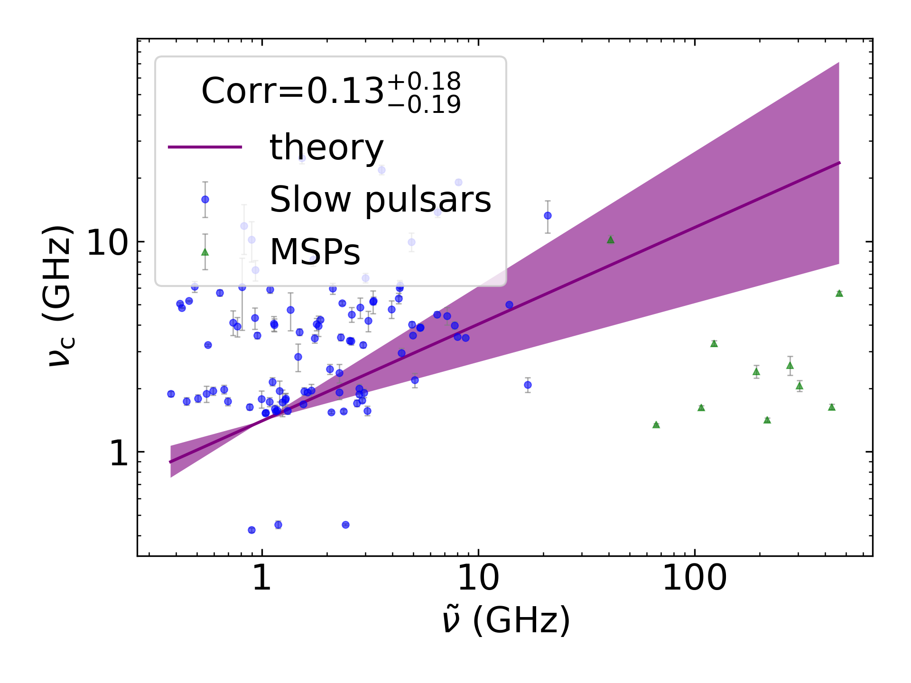
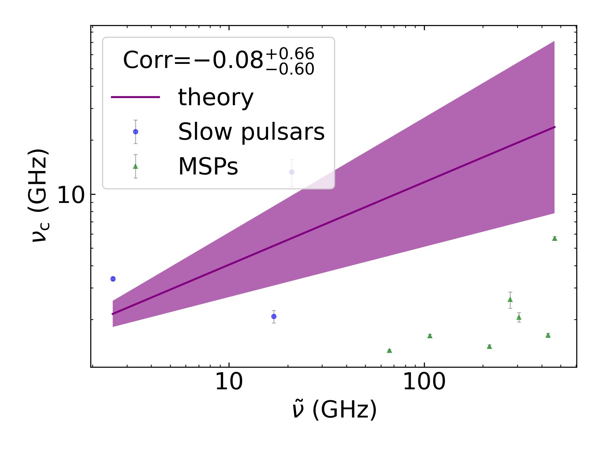
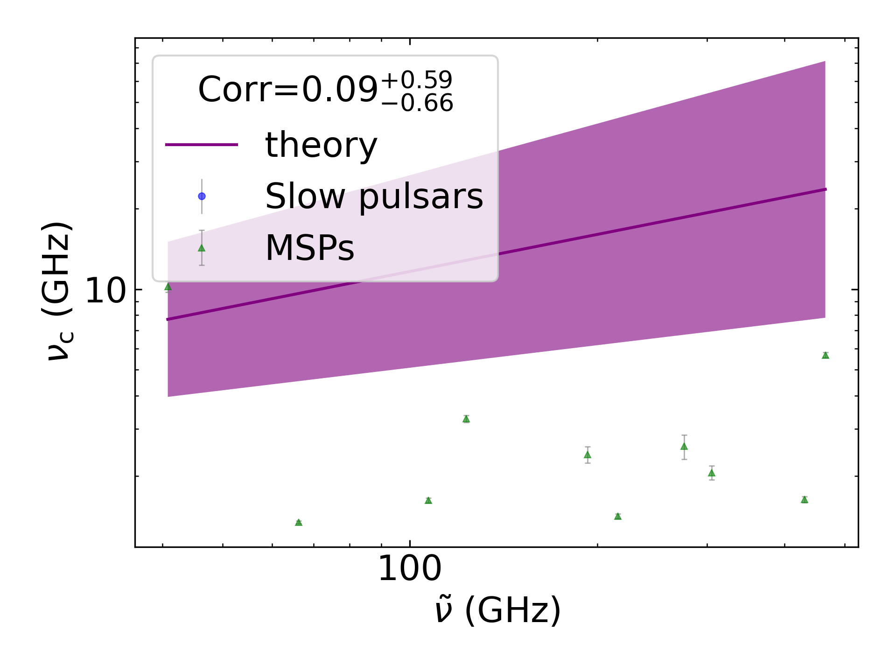
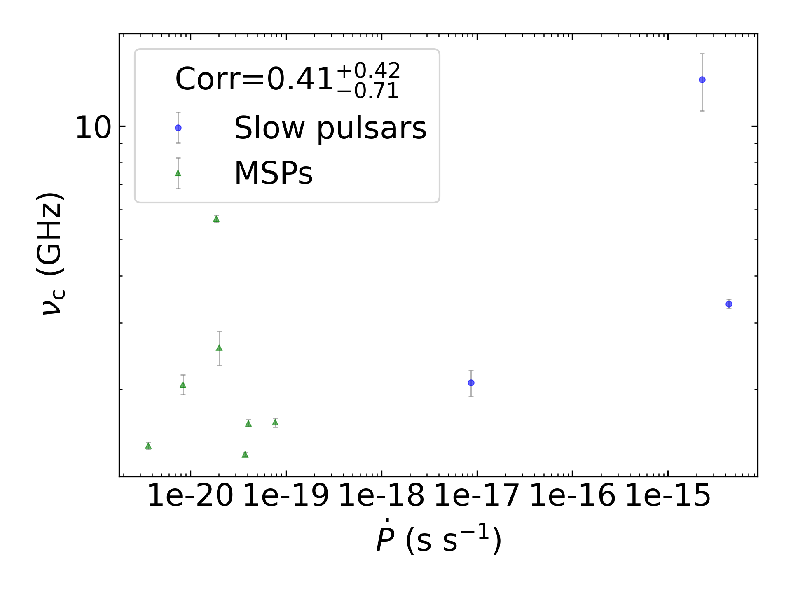
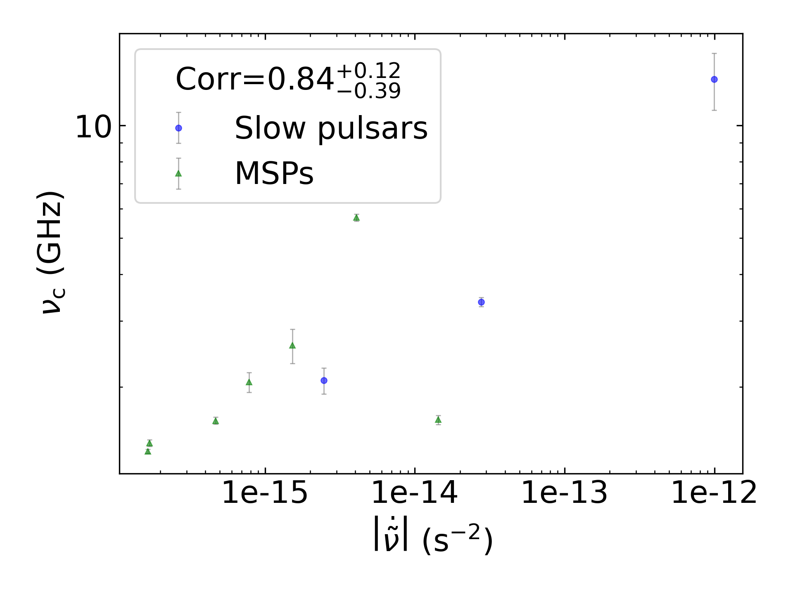
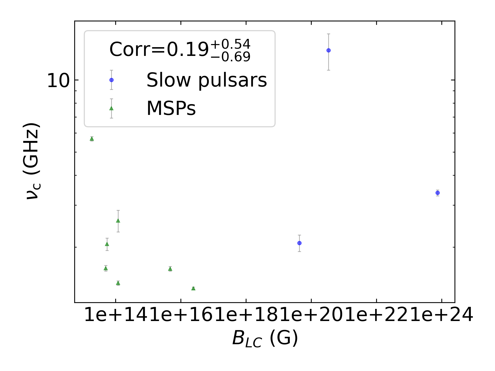
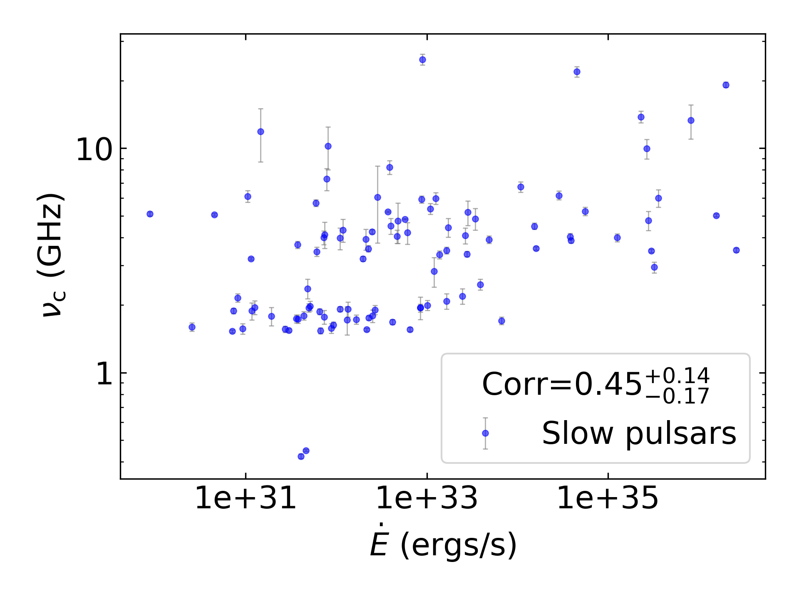
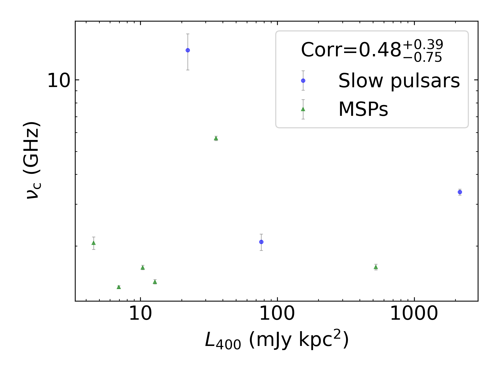
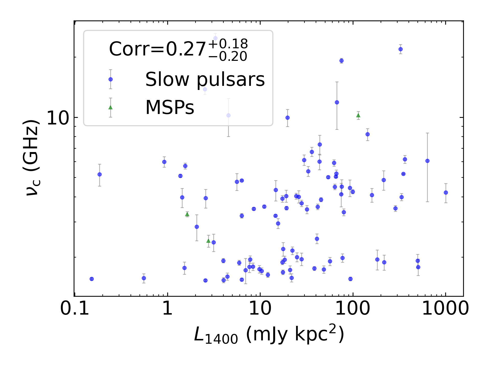

:math:`\nu_{c}` Summary
=======================

+------------------------------------------+--------------------------+--------------------------+--------------------------+--------------------------+--------------------------+
|                                      set |                      all |                in binary |                 isolated |                      MSP |                     slow |
+------------------------------------------+--------------------------+--------------------------+--------------------------+--------------------------+--------------------------+
|                                 #pulsars |                      123 |                       10 |                      113 |                       14 |                      109 |
+------------------------------------------+--------------------------+--------------------------+--------------------------+--------------------------+--------------------------+
|                :math:`{\bf log_{10}(x)}` | :math:`{\bf r_s (p, N)}` | :math:`{\bf r_s (p, N)}` | :math:`{\bf r_s (p, N)}` | :math:`{\bf r_s (p, N)}` | :math:`{\bf r_s (p, N)}` |
+==========================================+==========================+==========================+==========================+==========================+==========================+
|                      :math:`\tilde{\nu}` |    0.39 (4.1e-05, 106)   |   -0.04 (9.4e-01,   7)   |  **0.40 (4.0e-05,  99)** |   -0.10 (8.2e-01,   8)   |  **0.40 (3.7e-05,  98)** |
+------------------------------------------+--------------------------+--------------------------+--------------------------+--------------------------+--------------------------+
| :math:`\left| \dot{\tilde{\nu}} \right|` |  **0.40 (1.8e-05, 106)** |    0.14 (7.6e-01,   7)   |  **0.47 (1.1e-06,  99)** |   -0.12 (7.8e-01,   8)   |  **0.52 (4.9e-08,  98)** |
+------------------------------------------+--------------------------+--------------------------+--------------------------+--------------------------+--------------------------+
|                          :math:`\dot{P}` |    0.24 (1.5e-02, 106)   |   -0.46 (2.9e-01,   7)   |    0.29 (3.8e-03,  99)   |   -0.52 (1.8e-01,   8)   |    0.35 (4.8e-04,  98)   |
+------------------------------------------+--------------------------+--------------------------+--------------------------+--------------------------+--------------------------+
|                               :math:`DM` |    0.37 (9.4e-05, 106)   |   -0.21 (6.4e-01,   7)   |  **0.43 (7.0e-06,  99)** |   -0.19 (6.5e-01,   8)   |  **0.45 (2.8e-06,  98)** |
+------------------------------------------+--------------------------+--------------------------+--------------------------+--------------------------+--------------------------+
|                           :math:`B_{LC}` |   -0.28 (4.3e-03, 106)   |    0.04 (9.4e-01,   7)   |   -0.27 (6.1e-03,  99)   |    0.05 (9.1e-01,   8)   |   -0.27 (6.9e-03,  98)   |
+------------------------------------------+--------------------------+--------------------------+--------------------------+--------------------------+--------------------------+
|                             :math:`\tau` |   -0.34 (3.0e-04, 106)   |    0.21 (6.4e-01,   7)   |   -0.39 (5.7e-05,  99)   |    0.29 (4.9e-01,   8)   | **-0.47 (8.7e-07,  98)** |
+------------------------------------------+--------------------------+--------------------------+--------------------------+--------------------------+--------------------------+
|                          :math:`\dot{E}` |  **0.50 (6.9e-08, 106)** |    0.29 (5.3e-01,   7)   |  **0.51 (9.4e-08,  99)** |   -0.12 (7.8e-01,   8)   |  **0.51 (7.4e-08,  98)** |
+------------------------------------------+--------------------------+--------------------------+--------------------------+--------------------------+--------------------------+
|                          :math:`L_{400}` |   -0.02 (8.0e-01, 102)   |   -0.26 (6.2e-01,   6)   |    0.02 (8.4e-01,  96)   |   -0.21 (6.4e-01,   7)   |    0.01 (8.9e-01,  95)   |
+------------------------------------------+--------------------------+--------------------------+--------------------------+--------------------------+--------------------------+
|                         :math:`L_{1400}` |    0.26 (8.5e-03, 103)   |    0.04 (9.4e-01,   7)   |    0.31 (1.9e-03,  96)   |    0.14 (7.4e-01,   8)   |    0.31 (2.6e-03,  95)   |
+------------------------------------------+--------------------------+--------------------------+--------------------------+--------------------------+--------------------------+

:math:`\nu_{c}` Histogram
-------------------------

.. image:: histograms/vc_histogram.png
    :width: 800

:math:`\tilde{\nu}` Correlations
--------------------------------

All Pulsars
^^^^^^^^^^^

Only Binary Pulsars
^^^^^^^^^^^^^^^^^^^

Only Isolated Pulsars
^^^^^^^^^^^^^^^^^^^^^

.. image:: correlations/corr_line_vc_log_ATNF_Spin_Frequency_(Hz)_log_Only_Isolated_Pulsars.png
    :width: 800

Only MSPs
^^^^^^^^^

Only Slow Pulsars
^^^^^^^^^^^^^^^^^

.. image:: correlations/corr_line_vc_log_ATNF_Spin_Frequency_(Hz)_log_Only_Slow_Pulsars.png
    :width: 800

:math:`\dot{P}` Correlations
----------------------------

All Pulsars
^^^^^^^^^^^

.. image:: correlations/corr_line_vc_log_ATNF_Pdot_log_All_Pulsars.png
    :width: 800

Only Binary Pulsars
^^^^^^^^^^^^^^^^^^^

Only Isolated Pulsars
^^^^^^^^^^^^^^^^^^^^^

.. image:: correlations/corr_line_vc_log_ATNF_Pdot_log_Only_Isolated_Pulsars.png
    :width: 800

Only MSPs
^^^^^^^^^

.. image:: correlations/corr_line_vc_log_ATNF_Pdot_log_Only_MSPs.png
    :width: 800

Only Slow Pulsars
^^^^^^^^^^^^^^^^^

.. image:: correlations/corr_line_vc_log_ATNF_Pdot_log_Only_Slow_Pulsars.png
    :width: 800

:math:`\left| \dot{\tilde{\nu}} \right|` Correlations
-----------------------------------------------------

All Pulsars
^^^^^^^^^^^

.. image:: correlations/corr_line_vc_log_ATNF_Fdot_log_All_Pulsars.png
    :width: 800

Only Binary Pulsars
^^^^^^^^^^^^^^^^^^^

Only Isolated Pulsars
^^^^^^^^^^^^^^^^^^^^^

.. image:: correlations/corr_line_vc_log_ATNF_Fdot_log_Only_Isolated_Pulsars.png
    :width: 800

Only MSPs
^^^^^^^^^

.. image:: correlations/corr_line_vc_log_ATNF_Fdot_log_Only_MSPs.png
    :width: 800

Only Slow Pulsars
^^^^^^^^^^^^^^^^^

:math:`DM` Correlations
-----------------------

All Pulsars
^^^^^^^^^^^

.. image:: correlations/corr_line_vc_log_ATNF_DM_log_All_Pulsars.png
    :width: 800

Only Binary Pulsars
^^^^^^^^^^^^^^^^^^^

.. image:: correlations/corr_line_vc_log_ATNF_DM_log_Only_Binary_Pulsars.png
    :width: 800

Only Isolated Pulsars
^^^^^^^^^^^^^^^^^^^^^

.. image:: correlations/corr_line_vc_log_ATNF_DM_log_Only_Isolated_Pulsars.png
    :width: 800

Only MSPs
^^^^^^^^^

.. image:: correlations/corr_line_vc_log_ATNF_DM_log_Only_MSPs.png
    :width: 800

Only Slow Pulsars
^^^^^^^^^^^^^^^^^

.. image:: correlations/corr_line_vc_log_ATNF_DM_log_Only_Slow_Pulsars.png
    :width: 800

:math:`B_{LC}` Correlations
---------------------------

All Pulsars
^^^^^^^^^^^

Only Binary Pulsars
^^^^^^^^^^^^^^^^^^^

Only Isolated Pulsars
^^^^^^^^^^^^^^^^^^^^^

.. image:: correlations/corr_line_vc_log_ATNF_B_LC_(G)_log_Only_Isolated_Pulsars.png
    :width: 800

Only MSPs
^^^^^^^^^

.. image:: correlations/corr_line_vc_log_ATNF_B_LC_(G)_log_Only_MSPs.png
    :width: 800

Only Slow Pulsars
^^^^^^^^^^^^^^^^^

.. image:: correlations/corr_line_vc_log_ATNF_B_LC_(G)_log_Only_Slow_Pulsars.png
    :width: 800

:math:`\dot{E}` Correlations
----------------------------

All Pulsars
^^^^^^^^^^^

.. image:: correlations/corr_line_vc_log_ATNF_E_dot_(ergs_s)_log_All_Pulsars.png
    :width: 800

Only Binary Pulsars
^^^^^^^^^^^^^^^^^^^

.. image:: correlations/corr_line_vc_log_ATNF_E_dot_(ergs_s)_log_Only_Binary_Pulsars.png
    :width: 800

Only Isolated Pulsars
^^^^^^^^^^^^^^^^^^^^^

Only MSPs
^^^^^^^^^

.. image:: correlations/corr_line_vc_log_ATNF_E_dot_(ergs_s)_log_Only_MSPs.png
    :width: 800

Only Slow Pulsars
^^^^^^^^^^^^^^^^^

:math:`L_{400}` Correlations
----------------------------

All Pulsars
^^^^^^^^^^^

.. image:: correlations/corr_line_vc_log_L400_(mJy_kpc^2)_log_All_Pulsars.png
    :width: 800

Only Binary Pulsars
^^^^^^^^^^^^^^^^^^^

Only Isolated Pulsars
^^^^^^^^^^^^^^^^^^^^^

.. image:: correlations/corr_line_vc_log_L400_(mJy_kpc^2)_log_Only_Isolated_Pulsars.png
    :width: 800

Only MSPs
^^^^^^^^^

.. image:: correlations/corr_line_vc_log_L400_(mJy_kpc^2)_log_Only_MSPs.png
    :width: 800

Only Slow Pulsars
^^^^^^^^^^^^^^^^^

.. image:: correlations/corr_line_vc_log_L400_(mJy_kpc^2)_log_Only_Slow_Pulsars.png
    :width: 800

:math:`L_{1400}` Correlations
-----------------------------

All Pulsars
^^^^^^^^^^^

.. image:: correlations/corr_line_vc_log_L1400_(mJy_kpc^2)_log_All_Pulsars.png
    :width: 800

Only Binary Pulsars
^^^^^^^^^^^^^^^^^^^

.. image:: correlations/corr_line_vc_log_L1400_(mJy_kpc^2)_log_Only_Binary_Pulsars.png
    :width: 800

Only Isolated Pulsars
^^^^^^^^^^^^^^^^^^^^^

Only MSPs
^^^^^^^^^

.. image:: correlations/corr_line_vc_log_L1400_(mJy_kpc^2)_log_Only_MSPs.png
    :width: 800

Only Slow Pulsars
^^^^^^^^^^^^^^^^^

.. image:: correlations/corr_line_vc_log_L1400_(mJy_kpc^2)_log_Only_Slow_Pulsars.png
    :width: 800

:math:`\tau` Correlations
-------------------------

All Pulsars
^^^^^^^^^^^

.. image:: correlations/corr_line_vc_log_Age_(Yr)_log_All_Pulsars.png
    :width: 800

Only Binary Pulsars
^^^^^^^^^^^^^^^^^^^

.. image:: correlations/corr_line_vc_log_Age_(Yr)_log_Only_Binary_Pulsars.png
    :width: 800

Only Isolated Pulsars
^^^^^^^^^^^^^^^^^^^^^

.. image:: correlations/corr_line_vc_log_Age_(Yr)_log_Only_Isolated_Pulsars.png
    :width: 800

Only MSPs
^^^^^^^^^

.. image:: correlations/corr_line_vc_log_Age_(Yr)_log_Only_MSPs.png
    :width: 800

Only Slow Pulsars
^^^^^^^^^^^^^^^^^

.. image:: correlations/corr_line_vc_log_Age_(Yr)_log_Only_Slow_Pulsars.png
    :width: 800
