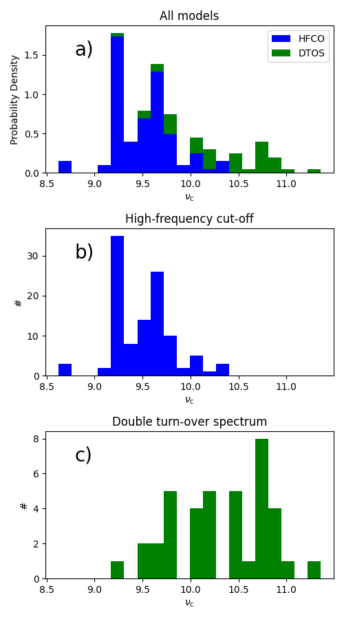
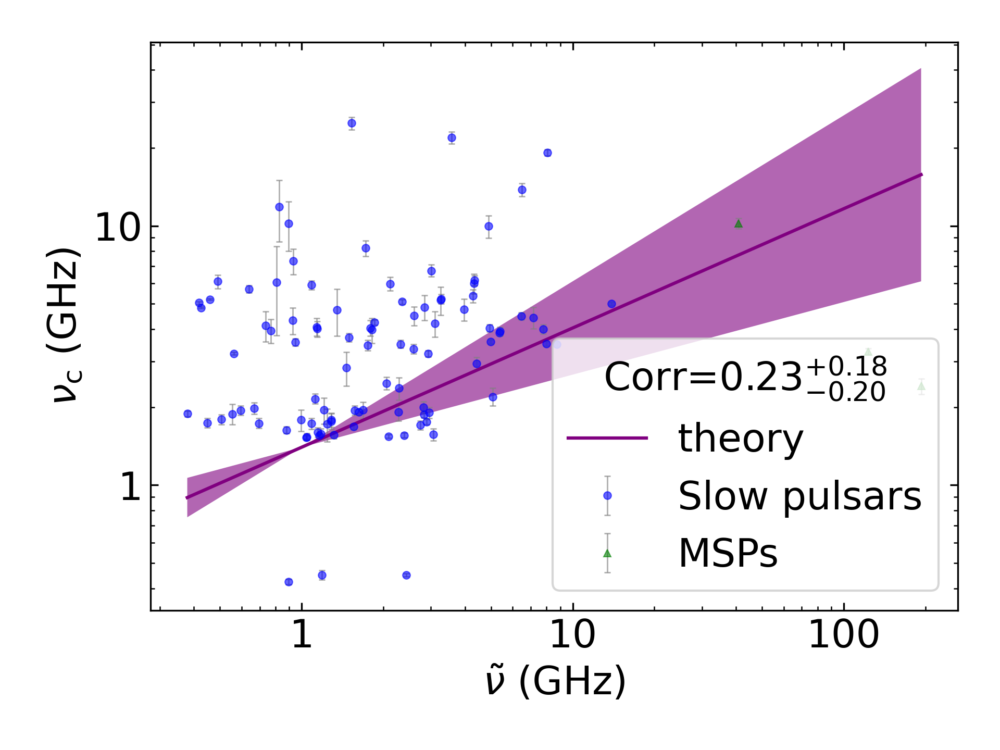
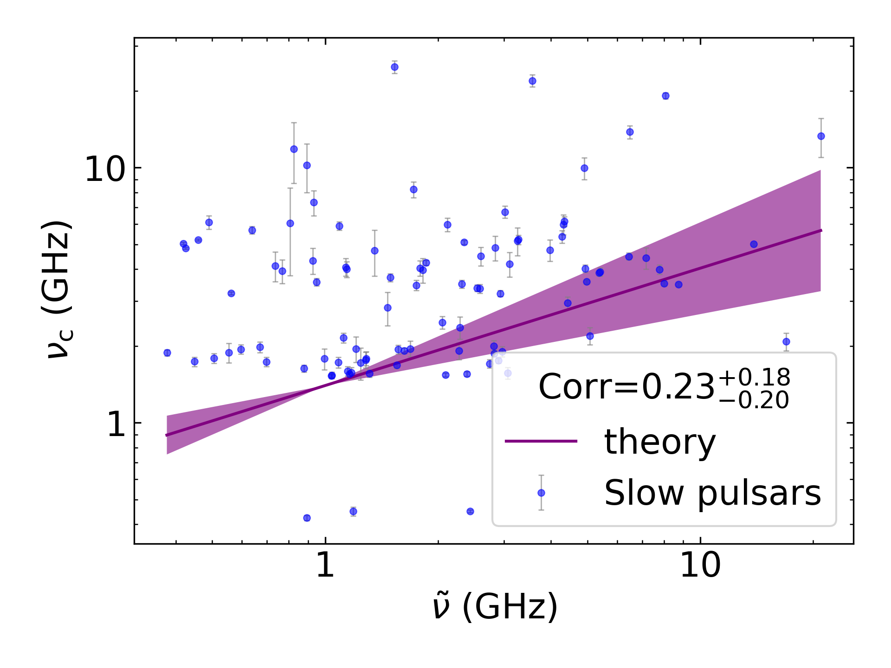
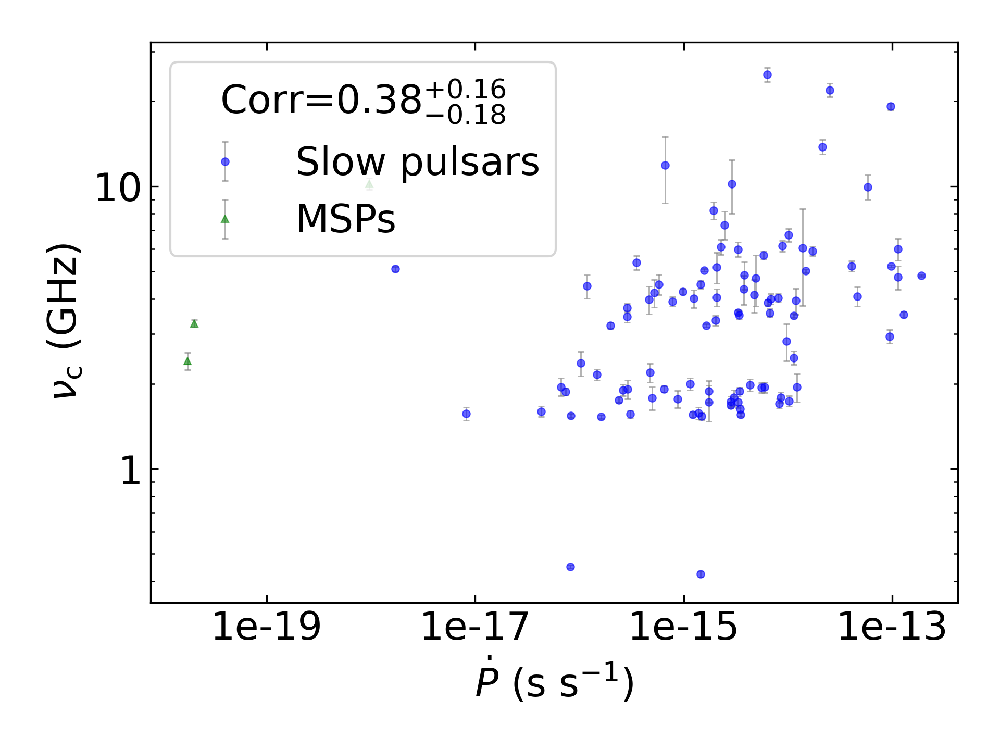
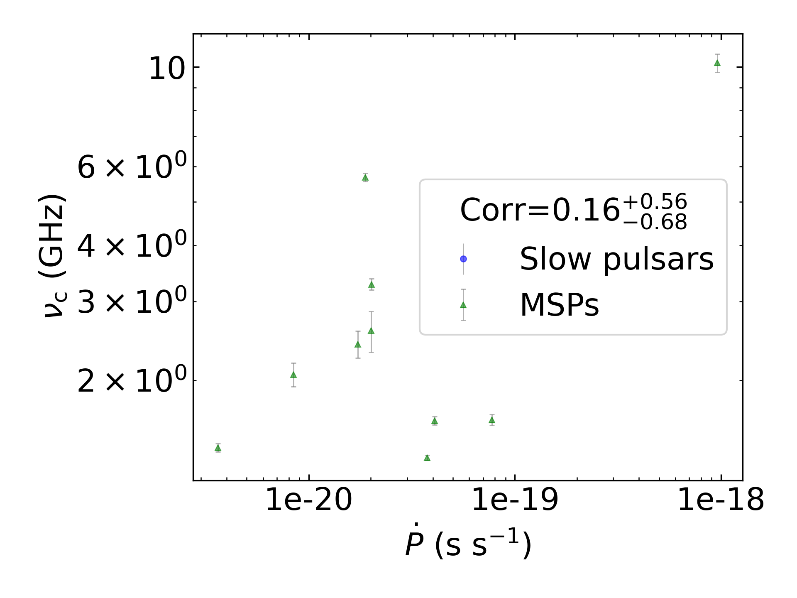
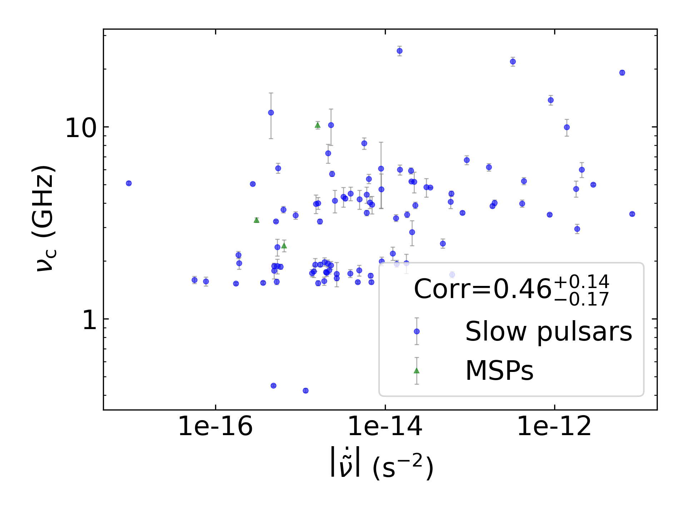
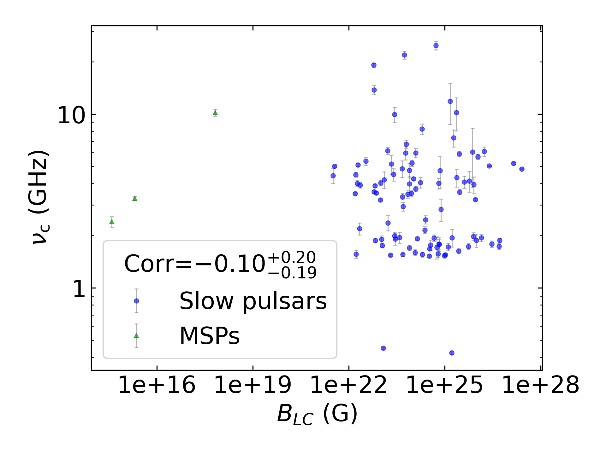
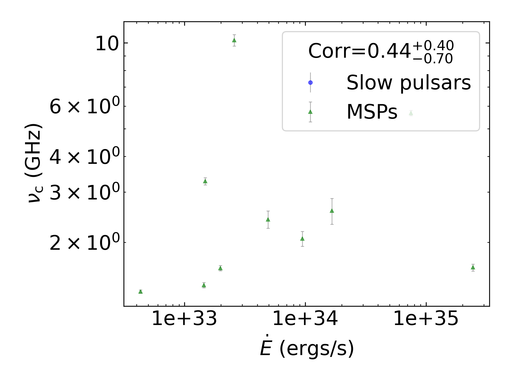
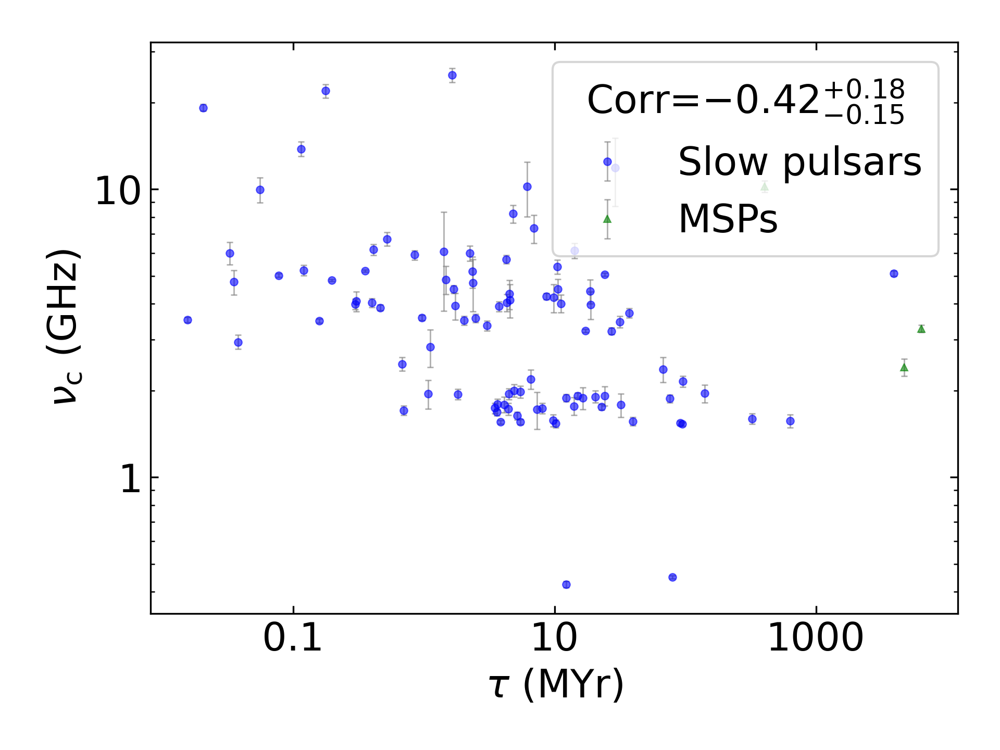
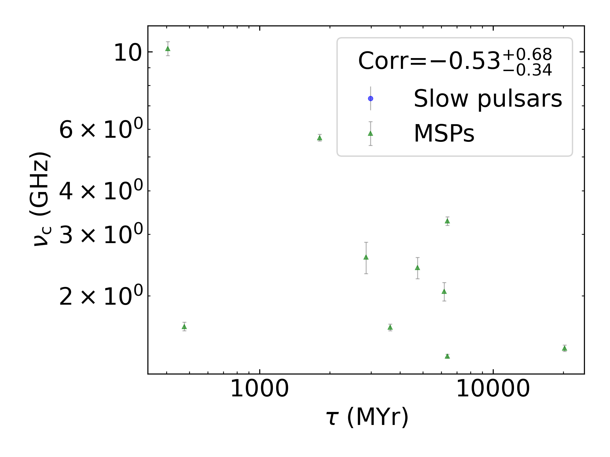

:math:`\nu_{c}` Summary
=======================

+------------------------------------------+--------------------------+--------------------------+--------------------------+--------------------------+--------------------------+
|                                      set |                      all |                in binary |                 isolated |                      MSP |                     slow |
+------------------------------------------+--------------------------+--------------------------+--------------------------+--------------------------+--------------------------+
|                                 #pulsars |                      134 |                       12 |                      122 |                       15 |                      119 |
+------------------------------------------+--------------------------+--------------------------+--------------------------+--------------------------+--------------------------+
|                :math:`{\bf log_{10}(x)}` | :math:`{\bf r_s (p, N)}` | :math:`{\bf r_s (p, N)}` | :math:`{\bf r_s (p, N)}` | :math:`{\bf r_s (p, N)}` | :math:`{\bf r_s (p, N)}` |
+==========================================+==========================+==========================+==========================+==========================+==========================+
|                      :math:`\tilde{\nu}` |    0.28 (3.1e-03, 108)   |   -0.18 (7.0e-01,   7)   |    0.28 (4.5e-03, 101)   |   -0.07 (8.7e-01,   8)   |    0.29 (3.9e-03, 100)   |
+------------------------------------------+--------------------------+--------------------------+--------------------------+--------------------------+--------------------------+
| :math:`\left| \dot{\tilde{\nu}} \right|` |  **0.45 (1.0e-06, 108)** |    0.43 (3.4e-01,   7)   |  **0.49 (1.6e-07, 101)** |    0.29 (4.9e-01,   8)   |  **0.53 (1.6e-08, 100)** |
+------------------------------------------+--------------------------+--------------------------+--------------------------+--------------------------+--------------------------+
|                          :math:`\dot{P}` |    0.32 (6.4e-04, 108)   |    0.21 (6.4e-01,   7)   |    0.40 (3.7e-05, 101)   |    0.10 (8.2e-01,   8)   |  **0.43 (6.4e-06, 100)** |
+------------------------------------------+--------------------------+--------------------------+--------------------------+--------------------------+--------------------------+
|                               :math:`DM` |    0.23 (1.5e-02, 108)   |    0.07 (8.8e-01,   7)   |    0.27 (6.8e-03, 101)   |    0.17 (6.9e-01,   8)   |    0.27 (6.2e-03, 100)   |
+------------------------------------------+--------------------------+--------------------------+--------------------------+--------------------------+--------------------------+
|                           :math:`B_{LC}` |   -0.16 (9.1e-02, 108)   |    0.18 (7.0e-01,   7)   |   -0.14 (1.6e-01, 101)   |    0.07 (8.7e-01,   8)   |   -0.14 (1.5e-01, 100)   |
+------------------------------------------+--------------------------+--------------------------+--------------------------+--------------------------+--------------------------+
|                             :math:`\tau` |   -0.40 (2.1e-05, 108)   |   -0.43 (3.4e-01,   7)   | **-0.46 (1.0e-06, 101)** |   -0.43 (2.9e-01,   8)   | **-0.52 (3.0e-08, 100)** |
+------------------------------------------+--------------------------+--------------------------+--------------------------+--------------------------+--------------------------+
|                          :math:`\dot{E}` |  **0.48 (1.2e-07, 108)** |    0.43 (3.4e-01,   7)   |  **0.49 (1.5e-07, 101)** |    0.26 (5.3e-01,   8)   |  **0.50 (1.2e-07, 100)** |
+------------------------------------------+--------------------------+--------------------------+--------------------------+--------------------------+--------------------------+
|                          :math:`L_{400}` |   -0.00 (9.6e-01, 103)   |   -0.14 (7.9e-01,   6)   |    0.04 (6.8e-01,  97)   |    0.21 (6.4e-01,   7)   |    0.02 (8.5e-01,  96)   |
+------------------------------------------+--------------------------+--------------------------+--------------------------+--------------------------+--------------------------+
|                         :math:`L_{1400}` |    0.23 (2.1e-02, 103)   |    0.71 (1.1e-01,   6)   |    0.27 (6.9e-03,  97)   |    0.79 (3.6e-02,   7)   |    0.26 (1.2e-02,  96)   |
+------------------------------------------+--------------------------+--------------------------+--------------------------+--------------------------+--------------------------+

:math:`\nu_{c}` Histogram
-------------------------

:math:`\tilde{\nu}` Correlations
--------------------------------

All Pulsars
^^^^^^^^^^^

.. image:: correlations/corr_line_vc_log_ATNF_Spin_Frequency_(Hz)_log_All_Pulsars.png
    :width: 800

Only Binary Pulsars
^^^^^^^^^^^^^^^^^^^

.. image:: correlations/corr_line_vc_log_ATNF_Spin_Frequency_(Hz)_log_Only_Binary_Pulsars.png
    :width: 800

Only Isolated Pulsars
^^^^^^^^^^^^^^^^^^^^^

Only MSPs
^^^^^^^^^

.. image:: correlations/corr_line_vc_log_ATNF_Spin_Frequency_(Hz)_log_Only_MSPs.png
    :width: 800

Only Slow Pulsars
^^^^^^^^^^^^^^^^^

:math:`\dot{P}` Correlations
----------------------------

All Pulsars
^^^^^^^^^^^

.. image:: correlations/corr_line_vc_log_ATNF_Pdot_log_All_Pulsars.png
    :width: 800

Only Binary Pulsars
^^^^^^^^^^^^^^^^^^^

.. image:: correlations/corr_line_vc_log_ATNF_Pdot_log_Only_Binary_Pulsars.png
    :width: 800

Only Isolated Pulsars
^^^^^^^^^^^^^^^^^^^^^

Only MSPs
^^^^^^^^^

Only Slow Pulsars
^^^^^^^^^^^^^^^^^

.. image:: correlations/corr_line_vc_log_ATNF_Pdot_log_Only_Slow_Pulsars.png
    :width: 800

:math:`\left| \dot{\tilde{\nu}} \right|` Correlations
-----------------------------------------------------

All Pulsars
^^^^^^^^^^^

.. image:: correlations/corr_line_vc_log_ATNF_Fdot_log_All_Pulsars.png
    :width: 800

Only Binary Pulsars
^^^^^^^^^^^^^^^^^^^

.. image:: correlations/corr_line_vc_log_ATNF_Fdot_log_Only_Binary_Pulsars.png
    :width: 800

Only Isolated Pulsars
^^^^^^^^^^^^^^^^^^^^^

Only MSPs
^^^^^^^^^

Only Slow Pulsars
^^^^^^^^^^^^^^^^^

.. image:: correlations/corr_line_vc_log_ATNF_Fdot_log_Only_Slow_Pulsars.png
    :width: 800

:math:`DM` Correlations
-----------------------

All Pulsars
^^^^^^^^^^^

Only Binary Pulsars
^^^^^^^^^^^^^^^^^^^

.. image:: correlations/corr_line_vc_log_ATNF_DM_log_Only_Binary_Pulsars.png
    :width: 800

Only Isolated Pulsars
^^^^^^^^^^^^^^^^^^^^^

Only MSPs
^^^^^^^^^

.. image:: correlations/corr_line_vc_log_ATNF_DM_log_Only_MSPs.png
    :width: 800

Only Slow Pulsars
^^^^^^^^^^^^^^^^^

.. image:: correlations/corr_line_vc_log_ATNF_DM_log_Only_Slow_Pulsars.png
    :width: 800

:math:`B_{LC}` Correlations
---------------------------

All Pulsars
^^^^^^^^^^^

.. image:: correlations/corr_line_vc_log_ATNF_B_LC_(G)_log_All_Pulsars.png
    :width: 800

Only Binary Pulsars
^^^^^^^^^^^^^^^^^^^

.. image:: correlations/corr_line_vc_log_ATNF_B_LC_(G)_log_Only_Binary_Pulsars.png
    :width: 800

Only Isolated Pulsars
^^^^^^^^^^^^^^^^^^^^^

Only MSPs
^^^^^^^^^

.. image:: correlations/corr_line_vc_log_ATNF_B_LC_(G)_log_Only_MSPs.png
    :width: 800

Only Slow Pulsars
^^^^^^^^^^^^^^^^^

.. image:: correlations/corr_line_vc_log_ATNF_B_LC_(G)_log_Only_Slow_Pulsars.png
    :width: 800

:math:`\dot{E}` Correlations
----------------------------

All Pulsars
^^^^^^^^^^^

.. image:: correlations/corr_line_vc_log_ATNF_E_dot_(ergs_s)_log_All_Pulsars.png
    :width: 800

Only Binary Pulsars
^^^^^^^^^^^^^^^^^^^

.. image:: correlations/corr_line_vc_log_ATNF_E_dot_(ergs_s)_log_Only_Binary_Pulsars.png
    :width: 800

Only Isolated Pulsars
^^^^^^^^^^^^^^^^^^^^^

.. image:: correlations/corr_line_vc_log_ATNF_E_dot_(ergs_s)_log_Only_Isolated_Pulsars.png
    :width: 800

Only MSPs
^^^^^^^^^

Only Slow Pulsars
^^^^^^^^^^^^^^^^^

.. image:: correlations/corr_line_vc_log_ATNF_E_dot_(ergs_s)_log_Only_Slow_Pulsars.png
    :width: 800

:math:`L_{400}` Correlations
----------------------------

All Pulsars
^^^^^^^^^^^

.. image:: correlations/corr_line_vc_log_L400_(mJy_kpc^2)_log_All_Pulsars.png
    :width: 800

Only Binary Pulsars
^^^^^^^^^^^^^^^^^^^

.. image:: correlations/corr_line_vc_log_L400_(mJy_kpc^2)_log_Only_Binary_Pulsars.png
    :width: 800

Only Isolated Pulsars
^^^^^^^^^^^^^^^^^^^^^

.. image:: correlations/corr_line_vc_log_L400_(mJy_kpc^2)_log_Only_Isolated_Pulsars.png
    :width: 800

Only MSPs
^^^^^^^^^

.. image:: correlations/corr_line_vc_log_L400_(mJy_kpc^2)_log_Only_MSPs.png
    :width: 800

Only Slow Pulsars
^^^^^^^^^^^^^^^^^

.. image:: correlations/corr_line_vc_log_L400_(mJy_kpc^2)_log_Only_Slow_Pulsars.png
    :width: 800

:math:`L_{1400}` Correlations
-----------------------------

All Pulsars
^^^^^^^^^^^

.. image:: correlations/corr_line_vc_log_L1400_(mJy_kpc^2)_log_All_Pulsars.png
    :width: 800

Only Binary Pulsars
^^^^^^^^^^^^^^^^^^^

.. image:: correlations/corr_line_vc_log_L1400_(mJy_kpc^2)_log_Only_Binary_Pulsars.png
    :width: 800

Only Isolated Pulsars
^^^^^^^^^^^^^^^^^^^^^

.. image:: correlations/corr_line_vc_log_L1400_(mJy_kpc^2)_log_Only_Isolated_Pulsars.png
    :width: 800

Only MSPs
^^^^^^^^^

.. image:: correlations/corr_line_vc_log_L1400_(mJy_kpc^2)_log_Only_MSPs.png
    :width: 800

Only Slow Pulsars
^^^^^^^^^^^^^^^^^

.. image:: correlations/corr_line_vc_log_L1400_(mJy_kpc^2)_log_Only_Slow_Pulsars.png
    :width: 800

:math:`\tau` Correlations
-------------------------

All Pulsars
^^^^^^^^^^^

.. image:: correlations/corr_line_vc_log_Age_(Yr)_log_All_Pulsars.png
    :width: 800

Only Binary Pulsars
^^^^^^^^^^^^^^^^^^^

.. image:: correlations/corr_line_vc_log_Age_(Yr)_log_Only_Binary_Pulsars.png
    :width: 800

Only Isolated Pulsars
^^^^^^^^^^^^^^^^^^^^^

Only MSPs
^^^^^^^^^

Only Slow Pulsars
^^^^^^^^^^^^^^^^^

.. image:: correlations/corr_line_vc_log_Age_(Yr)_log_Only_Slow_Pulsars.png
    :width: 800
