:math:`\nu_{\mathrm{c}}` Summary
=======================

+------------------------------------------+--------------------------+--------------------------+--------------------------+--------------------------+--------------------------+
|                                      set |                      all |                in binary |                 isolated |                      MSP |                     slow |
+------------------------------------------+--------------------------+--------------------------+--------------------------+--------------------------+--------------------------+
|                                 #pulsars |                      148 |                       18 |                      130 |                       18 |                      130 |
+------------------------------------------+--------------------------+--------------------------+--------------------------+--------------------------+--------------------------+
|                :math:`{\bf log_{10}(x)}` | :math:`{\bf r_s (p, N)}` | :math:`{\bf r_s (p, N)}` | :math:`{\bf r_s (p, N)}` | :math:`{\bf r_s (p, N)}` | :math:`{\bf r_s (p, N)}` |
+==========================================+==========================+==========================+==========================+==========================+==========================+
|                      :math:`\tilde{\nu}` |    0.13 (1.8e-01, 109)   |   -0.08 (8.3e-01,  10)   |    0.23 (2.4e-02,  99)   |    0.09 (8.0e-01,  10)   |    0.23 (1.9e-02,  99)   |
+------------------------------------------+--------------------------+--------------------------+--------------------------+--------------------------+--------------------------+
| :math:`\left| \dot{\tilde{\nu}} \right|` |  **0.50 (5.1e-08, 108)** |    0.84 (2.2e-03,  10)   |  **0.46 (2.4e-06,  98)** |    0.59 (7.4e-02,  10)   |  **0.49 (2.9e-07,  98)** |
+------------------------------------------+--------------------------+--------------------------+--------------------------+--------------------------+--------------------------+
|                          :math:`\dot{P}` |  **0.41 (1.2e-05, 108)** |    0.41 (2.4e-01,  10)   |    0.38 (1.2e-04,  98)   |    0.16 (6.5e-01,  10)   |  **0.41 (2.5e-05,  98)** |
+------------------------------------------+--------------------------+--------------------------+--------------------------+--------------------------+--------------------------+
|                               :math:`DM` |    0.38 (3.9e-05, 109)   |    0.58 (8.2e-02,  10)   |    0.33 (7.6e-04,  99)   |    0.20 (5.8e-01,  10)   |    0.33 (7.2e-04,  99)   |
+------------------------------------------+--------------------------+--------------------------+--------------------------+--------------------------+--------------------------+
|                           :math:`B_{LC}` |   -0.02 (8.5e-01, 108)   |    0.19 (6.0e-01,  10)   |   -0.10 (3.3e-01,  98)   |   -0.03 (9.3e-01,  10)   |   -0.10 (3.1e-01,  98)   |
+------------------------------------------+--------------------------+--------------------------+--------------------------+--------------------------+--------------------------+
|                             :math:`\tau` | **-0.46 (6.0e-07, 108)** |   -0.79 (6.1e-03,  10)   | **-0.42 (2.0e-05,  98)** |   -0.53 (1.2e-01,  10)   | **-0.47 (1.1e-06,  98)** |
+------------------------------------------+--------------------------+--------------------------+--------------------------+--------------------------+--------------------------+
|                          :math:`\dot{E}` |    0.40 (2.3e-05, 108)   |    0.72 (1.9e-02,  10)   |  **0.44 (4.6e-06,  98)** |    0.44 (2.0e-01,  10)   |  **0.45 (2.8e-06,  98)** |
+------------------------------------------+--------------------------+--------------------------+--------------------------+--------------------------+--------------------------+
|                          :math:`L_{400}` |    0.14 (1.7e-01, 104)   |    0.48 (1.9e-01,   9)   |    0.12 (2.3e-01,  95)   |    0.30 (4.3e-01,   9)   |    0.09 (3.8e-01,  95)   |
+------------------------------------------+--------------------------+--------------------------+--------------------------+--------------------------+--------------------------+
|                         :math:`L_{1400}` |    0.31 (1.3e-03, 103)   |    0.82 (7.2e-03,   9)   |    0.27 (8.5e-03,  94)   |    0.75 (2.0e-02,   9)   |    0.25 (1.7e-02,  94)   |
+------------------------------------------+--------------------------+--------------------------+--------------------------+--------------------------+--------------------------+

:math:`\nu_{\mathrm{c}}` Histogram
-------------------------

.. image:: histograms/vc_histogram.png
    :width: 800

:math:`\tilde{\nu}` Correlations
--------------------------------

All Pulsars
^^^^^^^^^^^

.. image:: correlations/corr_line_vc_log_ATNF_Spin_Frequency_(Hz)_log_All_Pulsars.png
    :width: 800

Only Binary Pulsars
^^^^^^^^^^^^^^^^^^^

.. image:: correlations/corr_line_vc_log_ATNF_Spin_Frequency_(Hz)_log_Only_Binary_Pulsars.png
    :width: 800

Only Isolated Pulsars
^^^^^^^^^^^^^^^^^^^^^

.. image:: correlations/corr_line_vc_log_ATNF_Spin_Frequency_(Hz)_log_Only_Isolated_Pulsars.png
    :width: 800

Only MSPs
^^^^^^^^^

.. image:: correlations/corr_line_vc_log_ATNF_Spin_Frequency_(Hz)_log_Only_MSPs.png
    :width: 800

Only Slow Pulsars
^^^^^^^^^^^^^^^^^

.. image:: correlations/corr_line_vc_log_ATNF_Spin_Frequency_(Hz)_log_Only_Slow_Pulsars.png
    :width: 800

:math:`\dot{P}` Correlations
----------------------------

All Pulsars
^^^^^^^^^^^

Only Binary Pulsars
^^^^^^^^^^^^^^^^^^^

.. image:: correlations/corr_line_vc_log_ATNF_Pdot_log_Only_Binary_Pulsars.png
    :width: 800

Only Isolated Pulsars
^^^^^^^^^^^^^^^^^^^^^

.. image:: correlations/corr_line_vc_log_ATNF_Pdot_log_Only_Isolated_Pulsars.png
    :width: 800

Only MSPs
^^^^^^^^^

.. image:: correlations/corr_line_vc_log_ATNF_Pdot_log_Only_MSPs.png
    :width: 800

Only Slow Pulsars
^^^^^^^^^^^^^^^^^

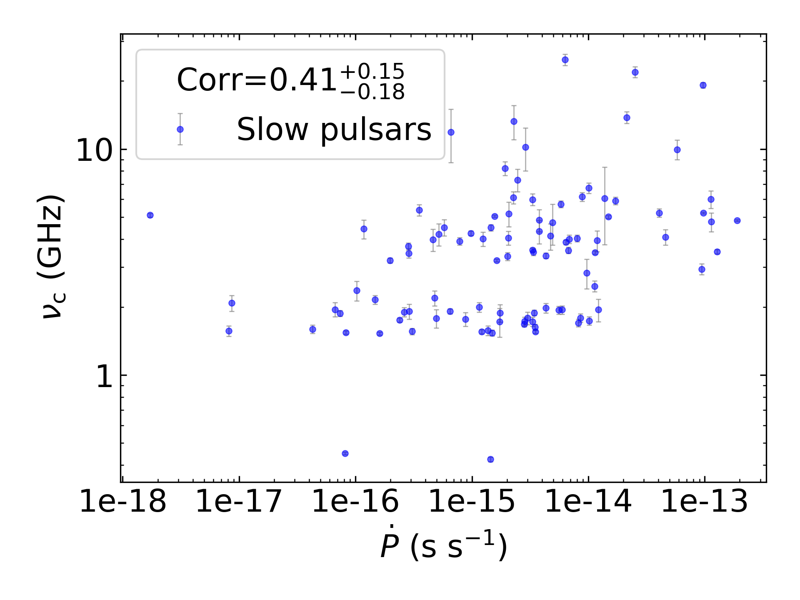

:math:`\left| \dot{\tilde{\nu}} \right|` Correlations
-----------------------------------------------------

All Pulsars
^^^^^^^^^^^

.. image:: correlations/corr_line_vc_log_ATNF_Fdot_log_All_Pulsars.png
    :width: 800

Only Binary Pulsars
^^^^^^^^^^^^^^^^^^^

.. image:: correlations/corr_line_vc_log_ATNF_Fdot_log_Only_Binary_Pulsars.png
    :width: 800

Only Isolated Pulsars
^^^^^^^^^^^^^^^^^^^^^

.. image:: correlations/corr_line_vc_log_ATNF_Fdot_log_Only_Isolated_Pulsars.png
    :width: 800

Only MSPs
^^^^^^^^^

.. image:: correlations/corr_line_vc_log_ATNF_Fdot_log_Only_MSPs.png
    :width: 800

Only Slow Pulsars
^^^^^^^^^^^^^^^^^

.. image:: correlations/corr_line_vc_log_ATNF_Fdot_log_Only_Slow_Pulsars.png
    :width: 800

:math:`DM` Correlations
-----------------------

All Pulsars
^^^^^^^^^^^

.. image:: correlations/corr_line_vc_log_ATNF_DM_log_All_Pulsars.png
    :width: 800

Only Binary Pulsars
^^^^^^^^^^^^^^^^^^^

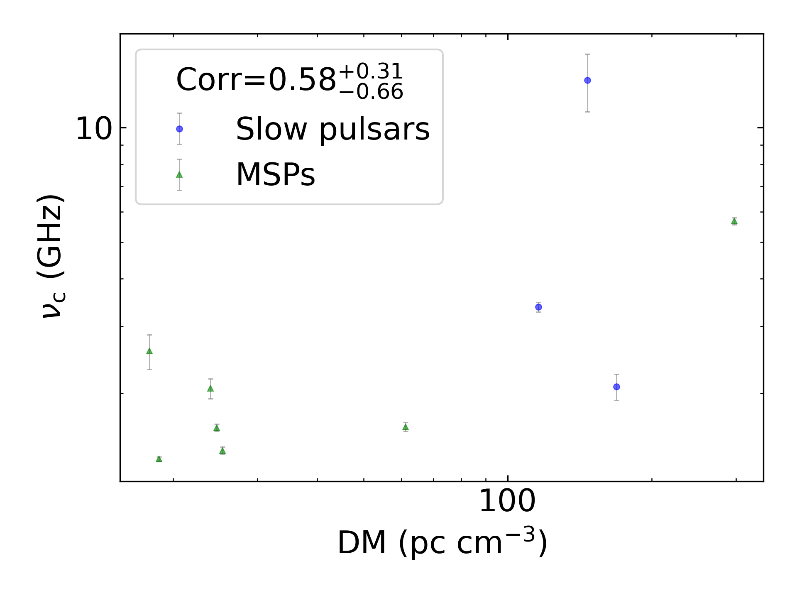

Only Isolated Pulsars
^^^^^^^^^^^^^^^^^^^^^

.. image:: correlations/corr_line_vc_log_ATNF_DM_log_Only_Isolated_Pulsars.png
    :width: 800

Only MSPs
^^^^^^^^^

.. image:: correlations/corr_line_vc_log_ATNF_DM_log_Only_MSPs.png
    :width: 800

Only Slow Pulsars
^^^^^^^^^^^^^^^^^

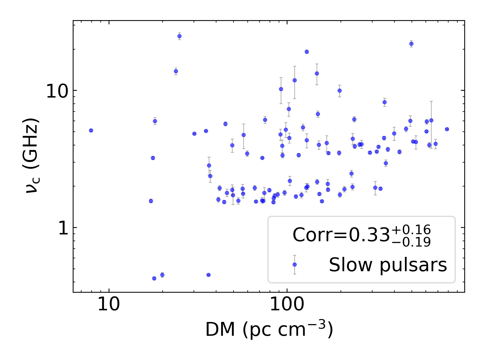

:math:`B_{LC}` Correlations
---------------------------

All Pulsars
^^^^^^^^^^^

.. image:: correlations/corr_line_vc_log_ATNF_B_LC_(G)_log_All_Pulsars.png
    :width: 800

Only Binary Pulsars
^^^^^^^^^^^^^^^^^^^

.. image:: correlations/corr_line_vc_log_ATNF_B_LC_(G)_log_Only_Binary_Pulsars.png
    :width: 800

Only Isolated Pulsars
^^^^^^^^^^^^^^^^^^^^^

.. image:: correlations/corr_line_vc_log_ATNF_B_LC_(G)_log_Only_Isolated_Pulsars.png
    :width: 800

Only MSPs
^^^^^^^^^

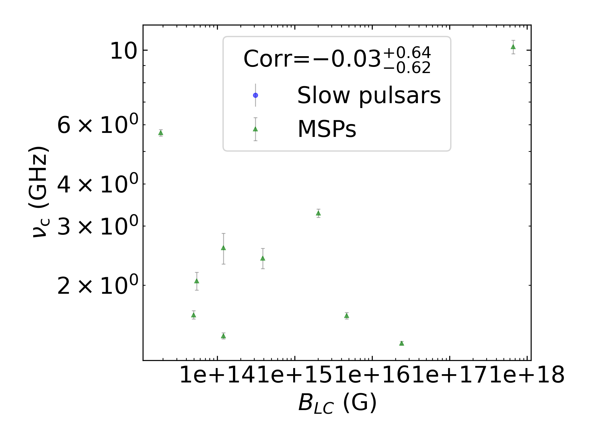

Only Slow Pulsars
^^^^^^^^^^^^^^^^^

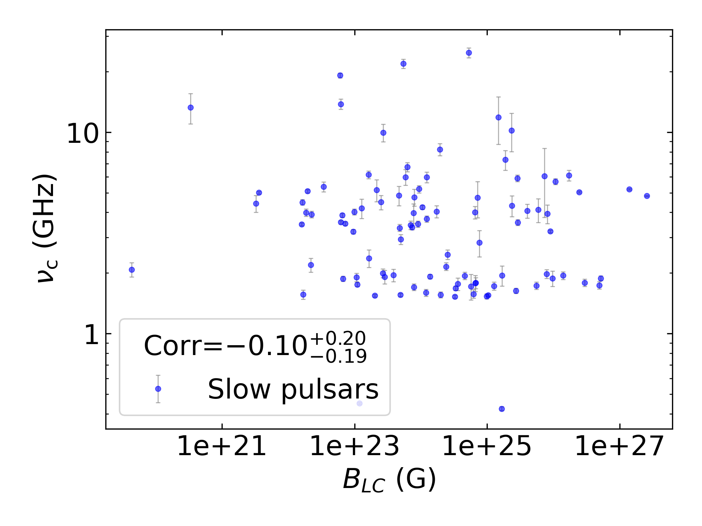

:math:`\dot{E}` Correlations
----------------------------

All Pulsars
^^^^^^^^^^^

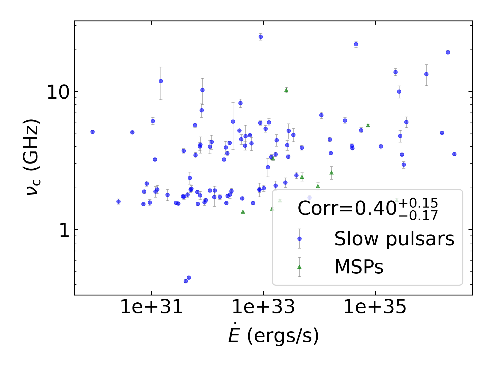

Only Binary Pulsars
^^^^^^^^^^^^^^^^^^^

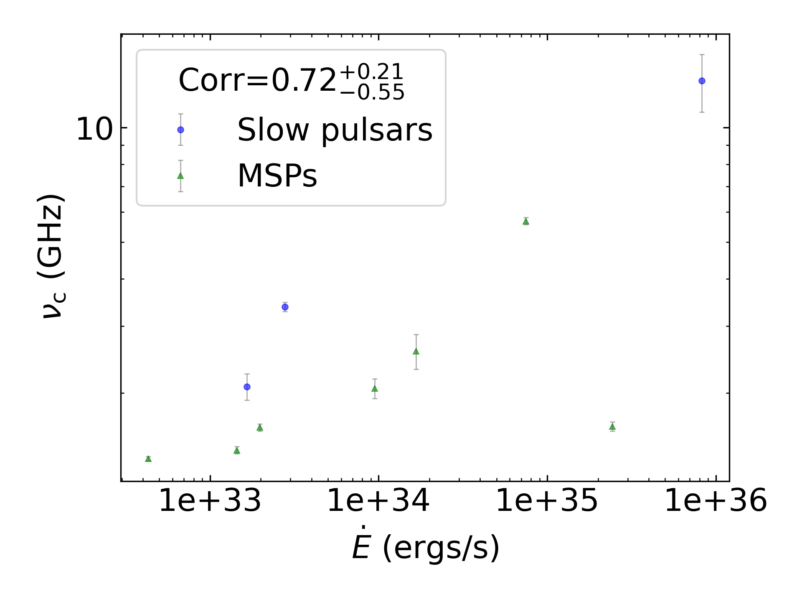

Only Isolated Pulsars
^^^^^^^^^^^^^^^^^^^^^

.. image:: correlations/corr_line_vc_log_ATNF_E_dot_(ergs_s)_log_Only_Isolated_Pulsars.png
    :width: 800

Only MSPs
^^^^^^^^^

.. image:: correlations/corr_line_vc_log_ATNF_E_dot_(ergs_s)_log_Only_MSPs.png
    :width: 800

Only Slow Pulsars
^^^^^^^^^^^^^^^^^

.. image:: correlations/corr_line_vc_log_ATNF_E_dot_(ergs_s)_log_Only_Slow_Pulsars.png
    :width: 800

:math:`L_{400}` Correlations
----------------------------

All Pulsars
^^^^^^^^^^^

.. image:: correlations/corr_line_vc_log_L400_(mJy_kpc^2)_log_All_Pulsars.png
    :width: 800

Only Binary Pulsars
^^^^^^^^^^^^^^^^^^^

.. image:: correlations/corr_line_vc_log_L400_(mJy_kpc^2)_log_Only_Binary_Pulsars.png
    :width: 800

Only Isolated Pulsars
^^^^^^^^^^^^^^^^^^^^^

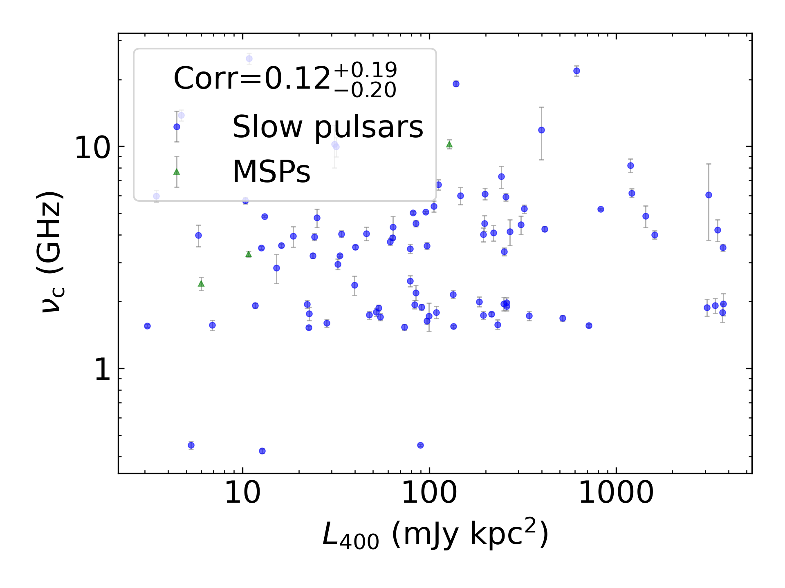

Only MSPs
^^^^^^^^^

.. image:: correlations/corr_line_vc_log_L400_(mJy_kpc^2)_log_Only_MSPs.png
    :width: 800

Only Slow Pulsars
^^^^^^^^^^^^^^^^^

.. image:: correlations/corr_line_vc_log_L400_(mJy_kpc^2)_log_Only_Slow_Pulsars.png
    :width: 800

:math:`L_{1400}` Correlations
-----------------------------

All Pulsars
^^^^^^^^^^^

Only Binary Pulsars
^^^^^^^^^^^^^^^^^^^

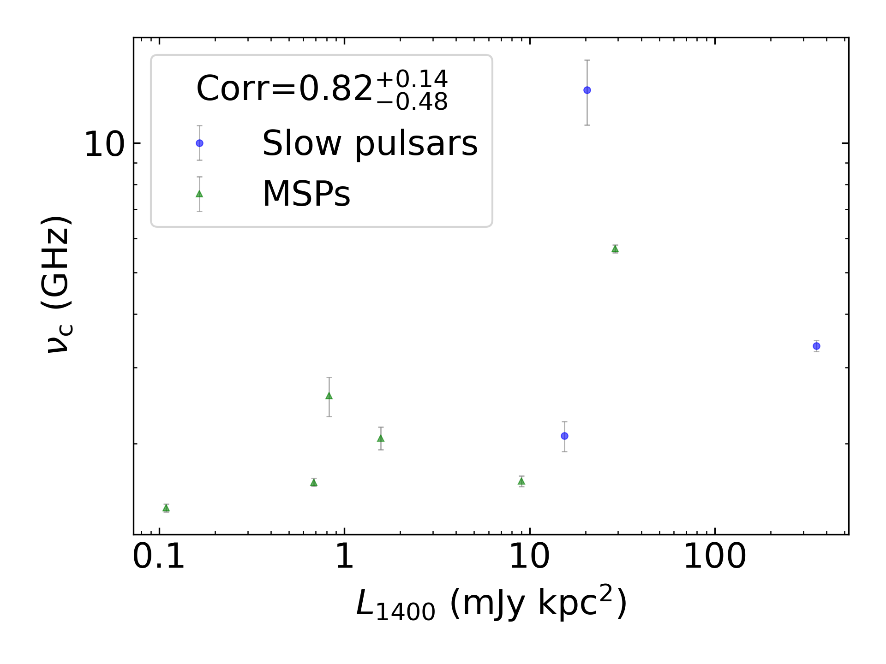

Only Isolated Pulsars
^^^^^^^^^^^^^^^^^^^^^

.. image:: correlations/corr_line_vc_log_L1400_(mJy_kpc^2)_log_Only_Isolated_Pulsars.png
    :width: 800

Only MSPs
^^^^^^^^^

.. image:: correlations/corr_line_vc_log_L1400_(mJy_kpc^2)_log_Only_MSPs.png
    :width: 800

Only Slow Pulsars
^^^^^^^^^^^^^^^^^

.. image:: correlations/corr_line_vc_log_L1400_(mJy_kpc^2)_log_Only_Slow_Pulsars.png
    :width: 800

:math:`\tau` Correlations
-------------------------

All Pulsars
^^^^^^^^^^^

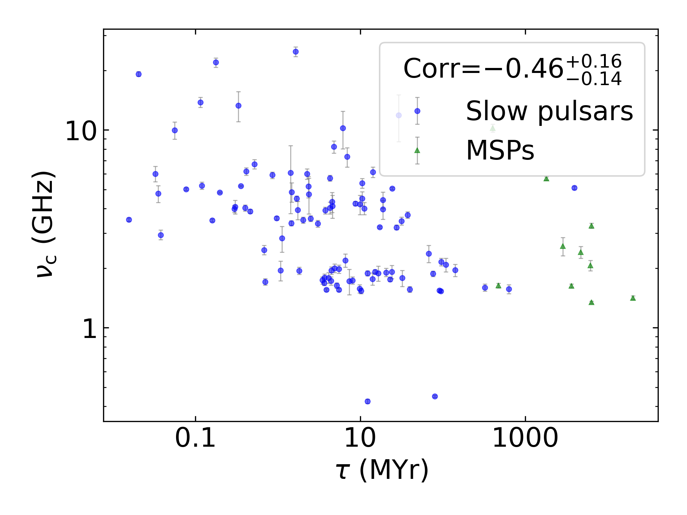

Only Binary Pulsars
^^^^^^^^^^^^^^^^^^^

.. image:: correlations/corr_line_vc_log_Age_(Yr)_log_Only_Binary_Pulsars.png
    :width: 800

Only Isolated Pulsars
^^^^^^^^^^^^^^^^^^^^^

.. image:: correlations/corr_line_vc_log_Age_(Yr)_log_Only_Isolated_Pulsars.png
    :width: 800

Only MSPs
^^^^^^^^^

.. image:: correlations/corr_line_vc_log_Age_(Yr)_log_Only_MSPs.png
    :width: 800

Only Slow Pulsars
^^^^^^^^^^^^^^^^^

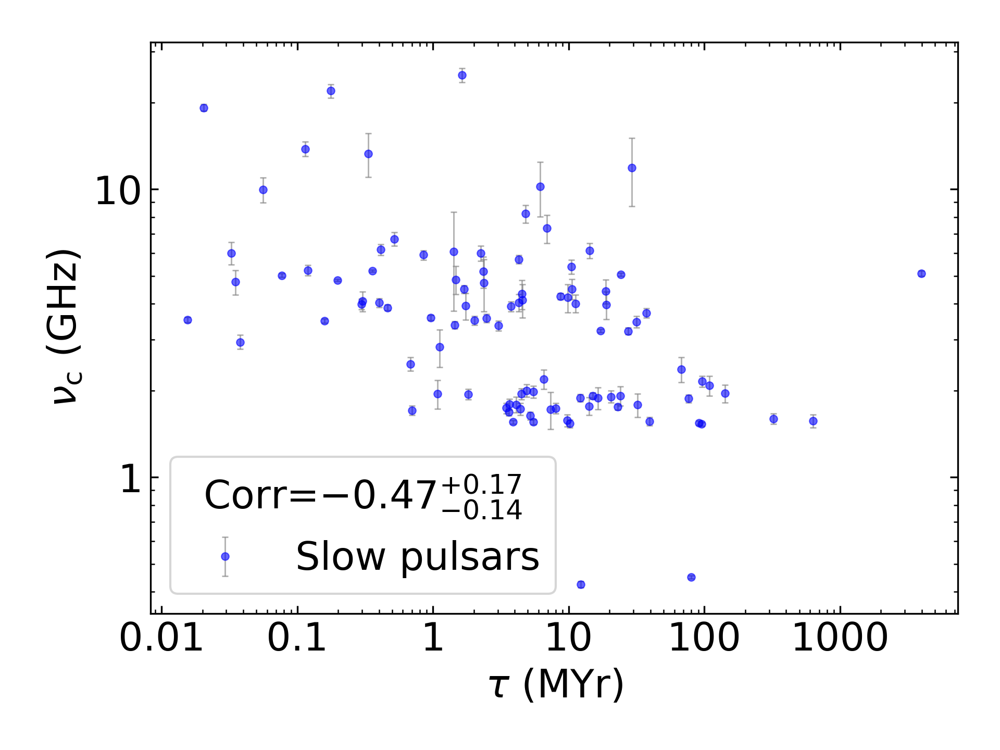
